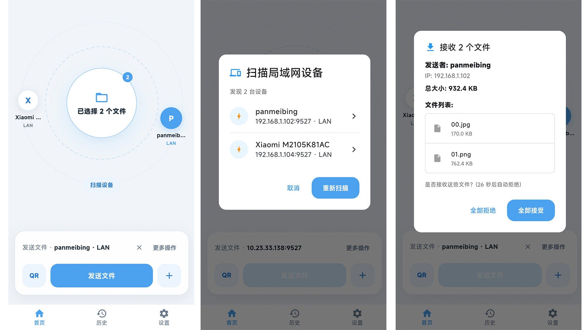
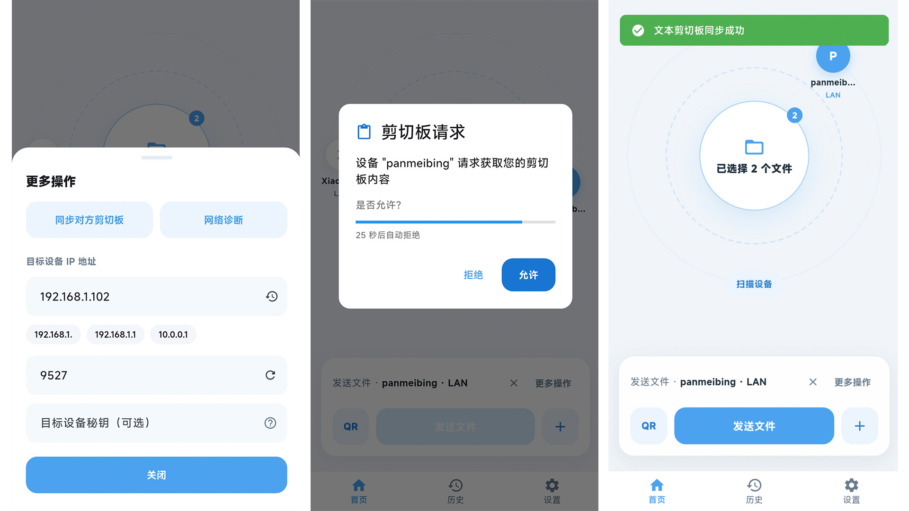
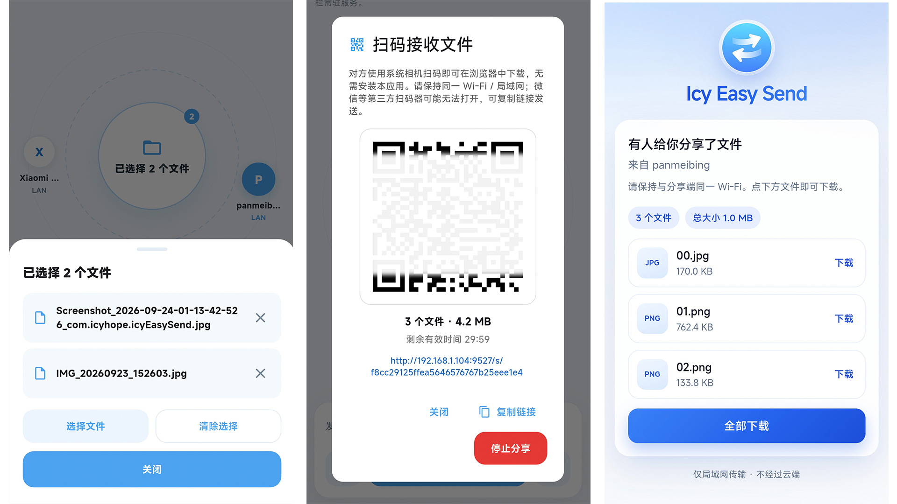

<div align="center">


# Icy Easy Send


An efficient, cross-platform file transfer application — LAN by default, optional self-hosted relay for cross-network use

[English](README.md) | [简体中文](README_CN.md)

[Screenshots](#-screenshots) • [Features](#-features) • [Branches](#-branches-main-vs-harmonyos) • [Quick Start](#-quick-start) • [Usage](#-usage) • [Architecture](#%EF%B8%8F-architecture) • [Development](#%EF%B8%8F-development-guide)

</div>

---

## 📖 Introduction

Icy Easy Send is a Flutter app for fast file transfer and clipboard sync between your devices. On the same LAN it works
with no internet and no accounts. Across different networks, you can optionally connect to a **self-hosted relay**
(`relayd`) for end-to-end encrypted transfer and clipboard sync after pairing.

### Why Choose Icy Easy Send?

- 🚀 **High-Speed Transfer**: Direct LAN connection when available; speed limited only by network bandwidth
- 🔒 **Secure & Reliable**: LAN traffic stays on your network; relay traffic is end-to-end encrypted (server sees ciphertext only)
- 🌐 **Cross-Network (optional)**: Pair once via your own relay, then send files and sync clipboard across LANs
- 📱 **Cross-Platform**: Android, iOS, Windows, macOS, and Linux on `main`; HarmonyOS NEXT on [`feat/support_harmony_os`](#-branches-main-vs-harmonyos)
- 🎯 **Easy to Use**: Scan for peers or enter an IP; pair by device code when using relay
- 📦 **Batch Transfer**: Send multiple files at once with automatic queue management
- 📋 **Clipboard Sync**: Synchronize text, files, and images across devices (LAN or relay)

---

## 📸 Screenshots

<p align="center">
  <strong>File Transfer</strong><br>
  Scan nearby devices, send files in one tap, and confirm receipt on the other side
</p>

<p align="center">
  
</p>

<p align="center">
  <strong>Clipboard Sync</strong><br>
  Sync text and media across devices with an explicit allow / deny prompt
</p>

<p align="center">
  
</p>

<p align="center">
  <strong>QR Code Share</strong><br>
  Share via QR code or link — recipients can download in a browser without installing the app
</p>

<p align="center">
  
</p>

---

## ✨ Features

### Core Functionality

- **File Transfer**
    - Support for single or batch file transfers
    - Real-time display of transfer progress, speed, and remaining time
    - Automatic handling of filename conflicts
    - Support for large file transfers (up to 20GB)
    - Configurable concurrent transfer count (1-10 files simultaneously)
    - Optional self-hosted relay with E2E encryption, resume, and LAN-preferred routing

- **Device Pairing**
    - Trust devices via short SAS confirmation (same LAN or via relay)
    - Relay pairing by device code; optional blocklist for unwanted requests

- **Clipboard Synchronization**
    - Cross-device text content synchronization
    - File URI synchronization support
    - Image format support (PNG, JPEG, BMP)
    - Configurable clipboard size limit (1-10MB)
    - Works over LAN HTTP or over the relay (small payloads on signaling; larger via encrypted stream)

- **User Experience**
    - Drag and drop file support (desktop platforms)
    - Share files from other apps to this application
    - IP address history and peer scan (LAN + relay-online peers)
    - Real-time IP address validation
    - Network status monitoring and auto-reconnection

- **Transfer History**
    - Complete transfer history records
    - Filter by type (All/Sent/Received)
    - Transfer statistics
    - Quick open file or folder
    - Configurable history retention count

- **Network Diagnostics**
    - Built-in network diagnostic tools
    - Network connection status detection
    - Port availability testing
    - Target device reachability check

---

## 🌿 Branches: `main` vs HarmonyOS

Official Flutter targets and **HarmonyOS NEXT** stay on separate branches so the two toolchains stay independent. `main` contains Android, iOS, Windows, macOS, and Linux. The HarmonyOS project (`ohos/`) and its build scripts live on **`feat/support_harmony_os`**.

| | **`main`** | **`feat/support_harmony_os`** |
|---|---|---|
| **Platforms** | Android, iOS, Windows, macOS, Linux | HarmonyOS NEXT, same Dart app; OH plugins injected via overrides |
| **Flutter SDK** | Official Flutter **3.41.2+** | A separate install of **Flutter-OH `oh-3.41.9-release`**. Keep it beside the official SDK, and leave `flutter upgrade` off that tree |
| **`pubspec.yaml`** | Dependency source of truth | Kept aligned with `main`. OH plugins stay out of this file |
| **OH plugins** | Unused | `installers/HarmonyOS/pubspec_overrides.yaml`, copied to a gitignored root `pubspec_overrides.yaml` by `pub-get.ps1` |
| **Native project** | `android/`, `ios/`, `windows/`, `macos/`, `linux/` | Tracked `ohos/` sources. `oh_modules/`, `build/`, HAP/APP packages, and the local signing `build-profile.json5` stay out of git |
| **Build command** | System `flutter` | `installers/HarmonyOS/flutter-oh.cmd` only |

**Day-to-day**

- Build and run HAP on **`feat/support_harmony_os`**. Environment and debug Run: [run-ohos.md](https://github.com/panmeibing/IcyEasySend/blob/feat/support_harmony_os/installers/HarmonyOS/run-ohos.md).
- Android, iOS, and desktop work stays on **`main`**. Before switching back, delete any root `pubspec_overrides.yaml`, then run official `flutter pub get`.
- Keep these out of commits toward `main`: root `pubspec_overrides.yaml`, HAP / `oh_modules`, and DevEco signing files (`.p12`, `.cer`, `.p7b`, local `build-profile.json5`). `ohos/` **source** can merge the same way as `android/`.

Docs on that branch (same paths on [Gitee](https://gitee.com/pan-meibing/icy-easy-send/tree/feat/support_harmony_os/installers/HarmonyOS)):

| Doc | Contents |
|---|---|
| [readme.md](https://github.com/panmeibing/IcyEasySend/blob/feat/support_harmony_os/installers/HarmonyOS/readme.md) | What the HarmonyOS branch changes relative to `main` |
| [run-ohos.md](https://github.com/panmeibing/IcyEasySend/blob/feat/support_harmony_os/installers/HarmonyOS/run-ohos.md) | DevEco Studio, Flutter-OH, and debug Run on a device or emulator |
| [release-signing.md](https://github.com/panmeibing/IcyEasySend/blob/feat/support_harmony_os/installers/HarmonyOS/release-signing.md) | Release signing, `.app` build, and AppGallery upload |

**On HarmonyOS** the features match the other platforms, with these OS limits:

- Received files are saved under a **public Downloads** path that Files can show (`Download/<package>/`).
- With ACL and a Profile that includes `READ_PASTEBOARD`, the app tries a silent clipboard read first (more often available on PC / 2-in-1). Otherwise it falls back to a **Paste to share** dialog, which is the usual path on phones. A matching device secret key skips only the allow / deny confirm. When the paste dialog is required, it still appears.
- A few plugins (the wakelock OH variant, system share intent) are only partly wired. Details are in the HarmonyOS installer readme.

---

## 🚀 Quick Start

### Requirements

- Flutter SDK: 3.41.2 or higher (official), for Android / iOS / desktop on `main`
- Dart SDK: 3.11.0 or higher
- Platform-specific development environment:
    - Android: Android Studio / Android SDK
    - iOS: Xcode (macOS only)
    - Windows: Visual Studio 2022
    - macOS: Xcode
    - Linux: Relevant development toolchain
    - HarmonyOS NEXT: DevEco Studio + Flutter-OH `oh-3.41.9-release` on [`feat/support_harmony_os`](#-branches-main-vs-harmonyos)

### Installation

1. **Clone the repository**

```bash
git clone <repository-url>
cd icy_easy_send
```

2. **Check out the branch for your target**

```bash
# Android, iOS, Windows, macOS, Linux
git checkout main

# HarmonyOS NEXT
git checkout feat/support_harmony_os
```

3. **Install dependencies**

```bash
# main — official Flutter
flutter pub get
```

On `feat/support_harmony_os` (Windows), use the OH wrapper. It copies plugin overrides, then runs `pub get`:

```powershell
.\installers\HarmonyOS\pub-get.ps1
```

4. **Run the application**

```bash
# Android
flutter run -d android

# iOS (macOS required)
flutter run -d ios

# Windows
flutter run -d windows

# macOS
flutter run -d macos

# Linux
flutter run -d linux
```

HarmonyOS (on `feat/support_harmony_os`, typically a Windows host):

```powershell
.\installers\HarmonyOS\flutter-oh.cmd run
```

### Build Release Version

```bash
# Android APK
flutter build apk --release

# Android App Bundle
flutter build appbundle --release

# iOS (macOS required)
flutter build ios --release

# Windows
flutter build windows --release

# macOS
flutter build macos --release

# Linux
flutter build linux --release
```

HarmonyOS HAP (`feat/support_harmony_os` + Flutter-OH):

```powershell
.\installers\HarmonyOS\flutter-oh.cmd build hap --release
```

Debug setup: [run-ohos.md](https://github.com/panmeibing/IcyEasySend/blob/feat/support_harmony_os/installers/HarmonyOS/run-ohos.md). Store release: [release-signing.md](https://github.com/panmeibing/IcyEasySend/blob/feat/support_harmony_os/installers/HarmonyOS/release-signing.md).

---

## 📱 Usage

### Basic Workflow

1. **Launch Application**
    - The HTTP server starts automatically when the app launches
    - View your device's IP address and port number at the top of the home page

2. **Send Files**
    - Enter the receiver's IP address, or tap scan and pick a discovered / relay-online peer
    - Click the "Select Files" button to choose files (or drag and drop files directly)
    - Click the "Send" button
    - Transfer begins after receiver confirms (LAN preferred when both paths are available)

3. **Receive Files**
    - Keep the application running
    - A confirmation dialog appears when someone sends you files
    - Review the file list and click "Receive"
    - Files are automatically saved to the downloads folder
    - On HarmonyOS, that path is the public Downloads directory Files can show (`Download/<package>/`)

4. **Sync Clipboard**
    - Select a peer (IP or scanned/relay peer chip on the home page)
    - Click the "Sync Remote Clipboard" button
    - After the other party confirms, their clipboard content syncs to your device
    - On **HarmonyOS**, the peer tries a silent clipboard read when `READ_PASTEBOARD` is granted. Otherwise a **Paste to share** dialog appears. A matching secret key skips only the allow / deny prompt; the paste step still runs when that dialog is required

5. **Cross-network via relay (optional)**
    - Deploy `relayd` on your own server (see [`relay/README.md`](relay/README.md))
    - In Settings, fill in the relay URL and access token (card above Paired devices)
    - On both devices, use "Pair via relay" with the peer's device code and confirm the matching 6-digit SAS out of band
    - Once paired and online on the relay, send files or sync clipboard without being on the same LAN

6. **View History**
    - Switch to the "History" tab
    - View all transfer records
    - Filter, open files, or delete records

### Advanced Settings

Configure in the "Settings" page:

- **Device Name**: Customize device name for easy identification by other devices
- **Relay Server**: URL + token; allow/deny inbound relay pairing; manage pairing blocklist from Paired devices
- **Concurrent Transfers**: Set the number of simultaneous file transfers (1-10)
- **History Count**: Set the number of history records to retain (10-1000)
- **Clipboard Size**: Set maximum clipboard content size (1-10MB)
- **IP Validation**: Enable/disable IP address format validation

Design notes for the relay path: [`docs/relay-design.md`](docs/relay-design.md).

---

## 🏗️ Architecture

### Project Structure

```
lib/
├── main.dart                          # Application entry point
├── l10n/                              # Internationalization (ARB sources + generated code)
│   ├── app_en.arb                    # Template locale (edit this for new keys)
│   ├── app_*.arb                     # Other locales
│   ├── app_localizations*.dart       # Generated by `flutter gen-l10n` (do not hand-edit)
│   └── current_localizations.dart    # Context-free lookup for services (`appText`)
├── models/                            # Data models
├── pages/                             # UI pages
│   ├── home_page.dart                # Home (orchestration)
│   ├── history_page.dart
│   ├── settings_page.dart            # Settings (orchestration)
│   ├── main_container.dart
│   ├── home/                         # Home controllers + section widgets
│   ├── settings/                     # Settings controllers + cards
│   ├── pairing/                      # Pairing confirmation UI
│   └── history/                      # History UI pieces
├── services/                          # Business logic services
│   ├── http_server_manager.dart
│   ├── file_transfer_service.dart
│   ├── clipboard_service.dart
│   ├── identity_service.dart         # Device identity (Ed25519)
│   ├── pairing_service.dart
│   ├── language_service.dart         # Locale preference
│   ├── relay/                        # Relay client (WSS, crypto, pairing, clipboard)
│   └── transfer/                     # File send/receive, batch, health check
├── transport/                         # Channel abstraction (LAN / relay / selection)
└── utils/                             # Shared helpers (logging, network, dialogs, …)
```

Self-hosted relay server lives in `relay/` — see [`relay/README.md`](relay/README.md). Protocol design: [`docs/relay-design.md`](docs/relay-design.md).

### Core Technology Stack

- **UI Framework**: Flutter 3.41.2+
- **Internationalization**: flutter_localizations + intl (`lib/l10n/*.arb`, `flutter gen-l10n`)
- **HTTP Server**: shelf + shelf_router
- **Network Communication**: http + dio + connectivity_plus; relay signaling via WebSocket (`dart:io`)
- **File Operations**: file_picker + path_provider
- **Permission Management**: permission_handler
- **Local Storage**: shared_preferences
- **Clipboard**: super_clipboard
- **Cryptography**: cryptography (relay E2E)
- **Device Information**: device_info_plus
- **Relay Server**: Go (`relayd`)

### Network Architecture

```
LAN (default):
┌─────────────┐                    ┌─────────────┐
│   Device A  │                    │   Device B  │
│ HTTP Client │ ──────────────────> │ HTTP Server │
│ HTTP Server │ <────────────────── │ HTTP Client │
└─────────────┘     (Port 9527)     └─────────────┘

Cross-network (optional, self-hosted):
┌─────────────┐     WSS + HTTPS      ┌──────────┐     WSS + HTTPS      ┌─────────────┐
│   Device A  │ <──────────────────> │  relayd  │ <──────────────────> │   Device B  │
└─────────────┘  signaling / streams └──────────┘  signaling / streams └─────────────┘
```

### File Transfer Flow

LAN path overview (relay path is signaling handshake + encrypted chunked streams; see the design doc):

```
Sender                                Receiver
  │                                    │
  ├─ 1. Health Check ─────────────────>│
  │<──────────────────────── Return Status │
  │                                    │
  ├─ 2. Batch Confirm Request ────────>│
  │   (Contains file list)             │
  │                                    ├─ Show confirmation dialog
  │                                    │
  │<──────────────────── 3. Return Confirmation │
  │   (Contains transferIds)           │
  │                                    │
  ├─ 4. Concurrent File Transfer ─────>│
  │   (Based on concurrency limit)     ├─ Receive and save files
  │                                    │
  ├─ 5. Save send history              ├─ 6. Save receive history
  │                                    │
```

---

## 🛠️ Development Guide

### Code Standards

- Follow Dart official style guide
- Use `flutter_lints` for code checking
- All public APIs must have documentation comments
- Use meaningful variable and function names

### Testing

```bash
# Static analysis (also runs in CI)
flutter analyze

# Unit / widget tests
flutter test

# Coverage (optional)
flutter test --coverage
```

CI (`.github/workflows/ci.yml`) runs `flutter analyze` and `flutter test` on Dart/Flutter changes. Relay Go checks live in `relay-ci.yml`.

### Logging System

The project uses a custom logging utility `LogUtil`:

```
import 'package:icy_easy_send/utils/log_util.dart';

// Info log
LogUtil.iTag('TAG', 'This is an info log');

// Warning log
LogUtil.wTag('TAG', 'This is a warning log');

// Error log
LogUtil.eTag('TAG', 'This is an error log', error, stackTrace);
```

### Adding New Features

1. Create new service classes in `lib/services/`
2. Define data models in `lib/models/`
3. Create UI pages in `lib/pages/`
4. Add utility functions in `lib/utils/`
5. Write unit tests
6. Update documentation

### Internationalization (i18n)

All user-visible strings live in **one** place: ARB files under `lib/l10n/`.
`flutter gen-l10n` (enabled via `generate: true` in `pubspec.yaml` and `l10n.yaml`)
generates `app_localizations*.dart`. Those Dart files are committed so a clean
checkout builds without an extra codegen step — **edit the `.arb` files, not the
generated Dart**.

| Layer | How to get strings |
|-------|--------------------|
| Widgets | `AppLocalizations.of(context)` — required so the UI rebuilds on language change |
| Services / HTTP / notifications (no `BuildContext`) | `appText` from `lib/l10n/current_localizations.dart` |

Thin facades such as `ErrorMessages` still exist for call-site convenience; they
delegate to `appText` and do **not** carry their own translation tables.

Supported locales today: `zh`, `zh_HK`, `en`, `ko`, `ja`, `fr`, `de`, `es`, `pt`,
`ru`, `it`, `nl` (plus “follow system” in Settings).

#### Adding a new string

1. Add the key (and `@key` placeholders if needed) to `lib/l10n/app_en.arb`.
2. Add the same key to every other `lib/l10n/app_*.arb`.
3. Run `flutter gen-l10n` (or `flutter pub get` / a normal build).
4. Use `AppLocalizations.of(context).yourKey` in UI, or `appText.yourKey` in services.

Missing translations are reported in `lib/l10n/untranslated.json` (gitignored).

#### Adding a new language

1. **Create** `lib/l10n/app_<code>.arb` (copy `app_en.arb`, set `"@@locale": "<code>"`, translate values).
2. **Register** the language in `lib/services/language_service.dart` (`_supportedLanguages`).
3. Run `flutter gen-l10n` and verify the new locale appears in Settings.

You do **not** hand-write `app_localizations_<code>.dart` or maintain parallel
message-provider maps anymore.

## 📦 Dependencies

### Main Dependencies

| Package                | Version | Purpose               |
|------------------------|---------|-----------------------|
| shelf                  | ^1.4.2  | HTTP server framework |
| shelf_router           | ^1.1.4  | Routing management    |
| http                   | ^1.2.2  | HTTP client           |
| file_picker            | ^10.3.8 | File selection        |
| path_provider          | ^2.1.5  | Path access           |
| permission_handler     | ^12.0.1 | Permission management |
| shared_preferences     | ^2.3.3  | Local storage         |
| device_info_plus       | ^11.5.0 | Device information    |
| connectivity_plus      | ^7.0.0  | Network monitoring    |
| super_clipboard        | ^0.9.1  | Clipboard operations  |
| desktop_drop           | ^0.7.0  | Drag and drop support |
| flutter_sharing_intent | ^2.0.4  | Sharing intent        |

For complete dependency list, see [pubspec.yaml](pubspec.yaml) (versions listed here may be outdated, please refer to
the configuration file)

---

## 🔧 Configuration

### Network Configuration

- **Default Port**: 9527
- **Port Range**: 9527-9537 (automatically selects available port)
- **Request Timeout**: 30 seconds
- **Health Check Timeout**: 5 seconds
- **File Transfer Timeout**: 60 seconds + file size related

### File Limits

- **Maximum File Size**: 20GB
- **Maximum Clipboard Size**: 2MB (configurable 1-10MB)
- **Concurrent Transfers**: 5 (configurable 1-10)

### History Records

- **Default Retention Count**: 100 records
- **Configurable Range**: 10-1000 records

---

## 🐛 Troubleshooting

### Cannot Connect to Target Device

1. Ensure both devices are on the same LAN
2. Check firewall settings to ensure port 9527 is not blocked
3. Confirm the target device's application is running
4. Use network diagnostic tools to check connection

### File Transfer Failed

1. Check if receiving device has sufficient storage space (a full disk shows a dedicated dialog)
2. Confirm file size doesn't exceed 20GB limit
3. Check if network connection is stable
4. View error information in history records

### Permission Issues

1. Check app permissions in settings
2. Manually grant storage, photo library, and other permissions
3. If permissions are permanently denied, manually enable them in system settings

### HarmonyOS: clipboard sync reports success, but the peer gets nothing

1. If the silent read failed, confirm **Paste to share** still appears and the user pasted, then confirmed
2. A matching secret key only auto-accepts the request. Paste-to-share still runs when ACL or silent read is unavailable
3. If `module.json5` declares `READ_PASTEBOARD`, the Release Profile must list that permission as well

More HarmonyOS build and environment issues: [run-ohos.md](https://github.com/panmeibing/IcyEasySend/blob/feat/support_harmony_os/installers/HarmonyOS/run-ohos.md).

---

## 📄 License

This project is licensed under the BSD 3-Clause License. See [LICENSE](LICENSE) file for details.

---

## 👨‍💻 Author

**冰冷的希望 (Icy Hope)**

---

## 🙏 Acknowledgments

Thanks to all open source project contributors, especially:

- Flutter Team
- Dart Team
- All dependency package maintainers

---

## 📮 Contact

For questions or suggestions, feel free to contact via:

- Submit an Issue
- Create a Pull Request

---

<div align="center">

**If this project helps you, please give it a ⭐️**

Made with ❤️ by 冰冷的希望

</div>
