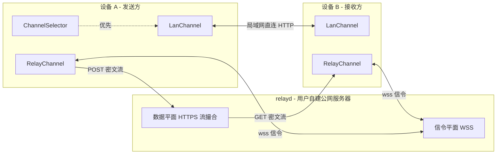
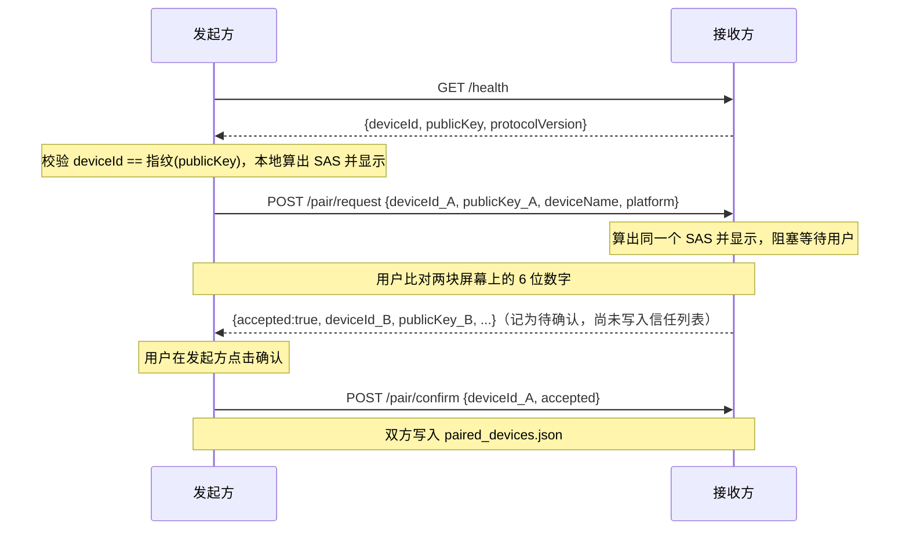
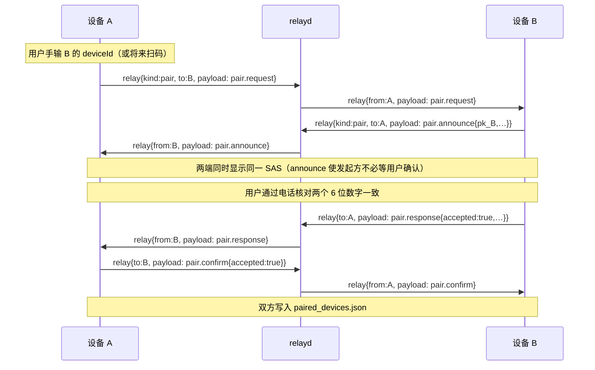
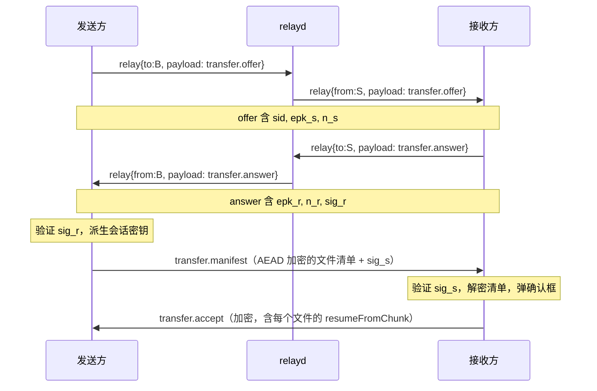
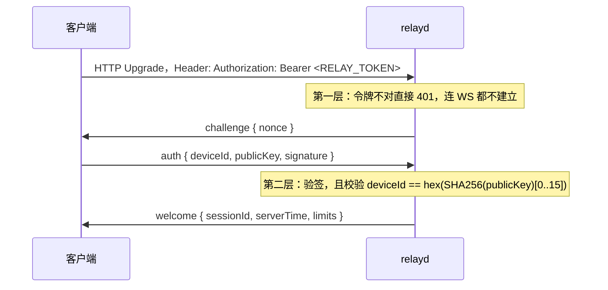

# 公网中转传输（Relay）技术设计文档

- 文档版本：v1.11（在 v1.10 已交付的 P0–P5 之上，同步**中转剪切板同步**、方式 B 配对 UX（`pair.announce`、显式拉黑、限流反馈）、首页纯中转设备选择与设置页顺序等实现差异；见 4.3、5.4、6.11）
- 协议版本：`icy-relay-v1`
- 适用主程序版本：Icy Easy Send v1.5.0 及以后
- 部署形态：**纯自建**。中转服务由用户自己部署在自己的公网服务器上，官方不提供公共实例。

---

## 1. 背景与目标

### 1.1 现状

当前应用是 LocalSend 风格的纯局域网 P2P 传输：

| 环节 | 现状实现 |
|---|---|
| 设备发现 | UDP 组播 `224.0.0.167` + 子网广播，失败时 HTTP `/health` 扫描子网 |
| 服务端 | 每台设备内嵌 `shelf` HTTP 服务器，端口 9527（占用则顺延到 9537） |
| 握手 | `POST /batch-confirm-receive`，返回 `{accepted, transferIds}` |
| 传输 | `POST /transfer?fileName=..&fileSize=..&transferId=..`，body 为裸二进制流（Dio `file.openRead()`） |
| 安全 | 明文 HTTP；可选共享密钥 `X-Secret-Key`，匹配则跳过确认弹窗 |
| 断点续传 | 无 |
| 传输通道抽象 | 无，HTTP 逻辑硬编码在 `BatchTransferManager` / `FileSender` / `TransferRequestBuilder` |

### 1.2 目标

1. 两台不在同一局域网的设备，借助用户自己的公网服务器完成文件传输。
2. **局域网可达时优先走局域网**，中转仅作为兜底，且切换对用户无感。
3. 中转服务器**无法读取文件内容和文件名**（剪切板内容同样端到端加密）。
4. 设备之间双向认证，任何第三方（包括服务器管理员）无法冒充已配对设备收发文件。
5. 公网链路不稳定，必须支持断点续传。
6. 已配对且中转在线时，可同步剪切板（小内容走信令，大内容走数据面）。

### 1.3 非目标（v1 明确不做）

- NAT 打洞 / STUN / TURN（后续可作为 relay 之外的第三条通道）
- 官方公共中转实例、账号体系、计费
- 网页分享（`/s/{token}`）走中转
- 一个设备同时连接多个中转服务器（决策 D4）
- 离线暂存：中转是实时管道，收发双方必须同时在线（决策 D10）
- SPAKE2 配对码（4.3 方式 C，推迟到 v2）
- 传输中途跨通道自动切换（决策 D9）

> **已从非目标中移除**：剪贴板经中转同步——已在客户端落地（见 6.11）。

---

## 2. 设计原则

**中转服务器是加密哑管道。** 它只做三件事：认证接入者、撮合两端、把字节从 A 搬到 B。它不解析文件、不落盘、不持有任何长期状态。

这条原则决定了后面所有取舍：

- 服务器无磁盘依赖 → 部署只需一个二进制，无数据库，无清理任务
- 服务器无明文 → 被攻破、被抓包、被翻日志都拿不到内容
- 服务器无状态 → 重启只影响进行中的传输，恢复靠客户端续传

**认证分三层，各管各的。** 「谁能用我的带宽」「你是不是那台设备」「我要不要收你的文件」是三个独立问题，不能像现在的 `X-Secret-Key` 一样用一个密钥全包。

**加密只加在需要的地方。** 局域网流量不出本地网络，纯 Dart AEAD 吞吐约 30 MB/s，会成为千兆局域网的瓶颈。因此端到端加密在中转链路上**强制**，在局域网链路上**默认关闭**（设置项可手动开启）。

**服务器只认 ID，不认人。** 客户端向中转服务器上报的信息裁剪到最少：只有 `deviceId` 和公钥，不含设备名、平台、版本。设备名通过端到端加密通道交换。

---

## 3. 总体架构



### 3.1 两个平面

| 平面 | 协议 | 用途 | 生命周期 |
|---|---|---|---|
| **信令平面** | WebSocket over TLS（`wss`） | 在线状态、传输邀请、E2E 握手、确认/拒绝、续传协商、结果回执 | 设备在线期间保持长连接 |
| **数据平面** | HTTPS chunked 流 | 只传加密后的文件字节 | 每个文件一条，用完即关 |

拆成两个平面的理由：

- 长连接只承载极小的 JSON 消息，服务器内存开销低，可以稳定保活。
- 文件流用独立的 HTTP 请求，可以并发多条、可以被单独取消、失败重试不影响信令。
- **数据平面复用现有 `FileSender` 的 Dio 流式 POST 代码**，改动量极小：把 URL 从 `http://192.168.x.x:9527/transfer` 换成 `https://relay.example.com/v1/stream/{streamId}`，`data: file.openRead()` 的写法完全不变（只是中间插一层加密 transform）。

### 3.2 关键标识

| 标识 | 生成方式 | 长度 | 说明 |
|---|---|---|---|
| `deviceId` | `hex(SHA-256(ed25519_pubkey)[0..15])` | 32 hex | **改造点**：当前是 `PreferencesService.getOrCreateDeviceId()` 生成的随机串，改为公钥指纹后即自带防伪能力 |
| `sessionId` (`sid`) | 客户端随机 | 16 字节 | 一次「一批文件」的传输会话 |
| `fileId` | `SHA-256(deviceId ‖ absPath ‖ size ‖ mtime)[0..15]` | 16 字节 | **必须确定性生成**，否则断点续传无法识别是同一个文件。不含内容哈希（决策 D5） |
| `streamId` | 服务器随机 | 32 字节 | 一条数据流的凭证，本身即是能力令牌 |

---

## 4. 密码学设计

### 4.1 算法选型

| 用途 | 算法 | 理由 |
|---|---|---|
| 设备身份 / 签名 | Ed25519 | 确定性签名、无需签名时的随机数、密钥仅 32 字节 |
| 密钥协商 | X25519（临时-临时） | 提供前向保密 |
| 密钥派生 | HKDF-SHA256 | 标准，域分离方便 |
| 对称加密 | ChaCha20-Poly1305（AEAD） | 无 AES 硬件加速的平台上比 AES-GCM 快得多；纯 Dart 实现约 30 MB/s，高于典型 VPS 上行带宽 |
| 传输层 | TLS 1.3（由反代或 relayd 自身提供） | 防御网络层攻击者；E2E 加密防御服务器本身 |

**Dart 侧依赖**：`cryptography`（^2.9.0，含 Ed25519 / X25519 / HKDF / ChaCha20-Poly1305 全部所需原语）+ `cryptography_flutter`（Android/iOS/macOS 原生加速）。若上游维护中断，可切换到社区 fork `cryptography_plus`，API 兼容。

> **性能注意**：Windows / Linux 上 `cryptography_flutter` 无原生实现，走纯 Dart，约 30 MB/s。加解密必须放在 **Isolate** 中执行，避免阻塞 UI 线程。这也是「局域网默认不加密」的直接原因。

### 4.2 设备身份

**状态：已在 P1 落地**（`lib/services/identity_service.dart`）。

每台设备首次启动时生成一对 Ed25519 长期密钥：

- 私钥存储：**全平台统一存放在应用支持目录下的 `identity.key` 文件**（决策 D8），不引入 `flutter_secure_storage`。
- 公钥公开：通过 `/health` 响应和 UDP 组播广播对外暴露。
- `deviceId` 从公钥派生，服务器和对端都会校验二者一致，杜绝「用别人的 deviceId 上线」。

**私钥文件的权限处理**（`dart:io` 没有 `chmod` API，需要分平台处理）：

| 平台 | 做法 |
|---|---|
| Linux / macOS / Android / iOS | 创建后调用 `Process.run('chmod', ['600', path])`；移动端的应用沙箱本身已隔离，chmod 是纵深防御 |
| Windows | 依赖 `%APPDATA%` 的默认 ACL（仅当前用户可访问），不做额外处理 |

**这个取舍要写清楚**：私钥以明文存放在用户目录下，与绝大多数桌面应用存放凭据的做法一致。它防不住「攻击者已经能读取当前用户的文件」这种情况——但在那个前提下设备本身已经失陷，私钥是否加密都无意义（解密密钥同样得存在本地）。放弃 `flutter_secure_storage` 的直接理由是它在 Linux 上依赖 `libsecret` 与运行中的 keyring 服务，会给现有打包脚本引入系统依赖，并在无桌面环境的机器上直接失败。

**兼容性**：`/health` 响应新增 `protocolVersion` 与 `publicKey` 字段。若对端未返回 `publicKey`，视为旧版本客户端，走现有的 `X-Secret-Key` 明文路径，功能不降级。

实现上，身份的加载失败**从不阻断任何既有功能**：`/health` 拿不到密钥时照旧返回不含身份字段的响应；组播广播回退到 `PreferencesService.getOrCreateDeviceId()` 生成的随机 ID；只有配对会因此不可用。密钥文件损坏或长度异常时直接重新生成——旧密钥已经无法使用，保留它没有意义，代价只是需要重新配对。

`identity.key` 的落盘格式带版本号，方便以后换算法：

```json
{"v": 1, "alg": "ed25519", "seed": "<base64 的 32 字节种子>"}
```

### 4.3 配对（Pairing）

配对的目的是让两台设备**互相记住对方的长期公钥**，之后走中转时不必再人工确认。

两种方式都基于同一个 6 位短认证串（SAS），区别只在于「用户怎么比对它」：

```
SAS = decimal(SHA-256("icy-pair-v1" ‖ pk_low ‖ pk_high))[0..5]
// pk_low / pk_high 为两个公钥按字节序排序后的结果，保证双方算出同一个值
```

#### 方式 A：局域网配对（默认）

**状态：已在 P1 落地**（`lib/services/pairing_service.dart`、`lib/services/pairing_handler.dart`）。

两台设备本来就能直连，走现有 HTTP 通道交换公钥。为防御「配对当时局域网里就有攻击者」这种 TOFU 风险，双方屏幕同时显示 SAS，用户**肉眼比对**两块屏幕一致后点击确认。

实际落地的报文序列如下。它比草图多了一次 `/pair/confirm`，原因见下方说明：



两处值得记录的设计取舍：

**公钥从 `/health` 取，而不是在 `/pair/request` 的响应里第一次见到。** 公钥本来就是公开的，提前拿到才能让发起方在**发出请求之前**就把 SAS 显示出来——否则接收方的弹窗先出现、发起方要等响应回来才显示，两块屏幕不同时在线，「比对」就无从谈起。发起方随后会校验 `/pair/request` 响应里的公钥与 `/health` 拿到的一致，堵住两次调用之间被掉包的缝隙。

**两阶段提交。** 接收方点「一致」时只是把请求记为待确认（TTL 2 分钟），要等发起方的 `/pair/confirm` 才真正写入信任列表。否则发起方用户看出数字不一致而取消时，接收方已经单边信任了对方。发起方同样只在 `/pair/confirm` 成功后才写本地记录，避免反向的单边配对。

**没有界面就一律拒绝。** 应用在后台或拿不到 `BuildContext` 时，`/pair/request` 直接返回 `no_ui`。配对是唯一不能自动化的动作——没有人核对数字，这套机制就没有任何认证效力。同时一次只允许一个配对弹窗（`busy`），避免用户被要求同时比对两组数字。

#### 方式 B：中转首次连接配对（决策 D6）

允许两台从未同处一个局域网的设备通过中转完成首次配对，SAS 由用户**口头核对**（电话、微信语音等带外渠道）。



几个必须处理的点：

**deviceId 如何告知对方。** 对端的 32 位十六进制 `deviceId` 需要带外传递。当前设置页以「本机设备码」纯文本 + 复制为主；二维码带外传递可后续再补。手动输入 32 位十六进制是现网路径。

**服务器必须允许向未订阅的设备投递配对请求。** 5.4 节规定在线状态需双向订阅才可见，但 `relay` 类型的消息投递不设此限制——只要目标设备在线，服务器就转发。否则素未谋面的两台设备永远无法发起第一次握手。

**由此产生的骚扰面必须收敛**，因为持有服务器令牌的任何设备都能向任意 `deviceId` 发配对请求：

- 服务端对 `kind: "pair"` 的信令单独限流：每设备每分钟最多 5 条，超出返回 `rate_limited`（客户端发起配对时必须等待该错误，不能 fire-and-forget，否则会出现「前几次有提示、再试就沉默」）。
- 客户端设置项「允许通过中转接收配对请求」，默认开启，可关闭。
- **显式拉黑**，而不是「点一次取消就永久静默」：
  - 入站确认框提供「不一致，取消」与「拉黑」。仅「拉黑」写入本地黑名单。
  - 普通取消只拒绝本次，对方可立刻再试。
  - 黑名单内的再次请求立即回 `blocked`（有明确文案），**不得静默丢弃**。
  - 设置页「已配对设备」旁可管理黑名单并移出条目。
  - 取消配对只删本机信任列表，不通知对端；若对端仍信任本机，重配时对端回 `already_paired`，文案提示对方先取消配对。

**安全性边界要向用户讲清楚。** 中转服务器完全有能力在 `pair.request` / `pair.announce` / `pair.response` 中替换公钥来发起中间人攻击——但那样两端算出的 SAS 必然不同。**这套机制的安全性完全依赖用户真的去核对那 6 位数字**。因此配对界面不能把 SAS 做成一个容易被无脑点过的提示，而应该要求用户主动确认「我已与对方核对，数字一致」。

**状态：已在 P3 落地，并在后续迭代中按上文收敛了 UX**（`lib/services/relay/relay_pairing_service.dart`、`pairing_confirm_dialog.dart`）。`pair.announce` 保证两端可同时亮码；`pair.confirm` 保证两段提交。详见 6.8 与 6.11。

#### 方式 C：SPAKE2 配对码（v2，暂不实现）

用低熵配对码替代人工核对。**6 位码熵极低，必须走 PAKE（推荐 SPAKE2），不能简单地把码当密钥**，否则中转服务器可以离线爆破。安全性优于方式 B 且无需用户核对，但 Dart 侧没有现成可靠的 SPAKE2 实现，工作量不小，排到 v2。

**信任列表**存储在应用支持目录的 `paired_devices.json`（不放 SharedPreferences，因为条目可能较多），P1 已落地为 `PairedDeviceStore`：

```json
[
  {
    "deviceId": "a3f2...",
    "publicKey": "base64...",
    "deviceName": "小米 14",
    "platform": "android",
    "pairedAt": 1770000000,
    "autoAccept": true,
    "lastSeenLan": "192.168.1.23:9527"
  }
]
```

两条实现约束：

- `deviceId` 是公钥指纹，因此**同一个 `deviceId` 出现不同公钥只可能是冒充**。`upsert()` 遇到这种情况会拒绝写入并返回 `false`，而不是静默轮换已信任的密钥。
- `autoAccept` 字段已持久化，但 P1 不读它，界面上也不提供开关。跳过接收确认弹窗只有在传输请求带签名、能真正认出发送方之后才安全，因此留到 P2/P3 一起接。

### 4.4 会话握手（SIGMA-I 风格）

**状态：已在 P3 落地**（`lib/services/relay/relay_crypto.dart`）。

双方已通过配对持有对方的 Ed25519 公钥。每次传输会话执行以下三步握手，全部封装在信令的不透明 `payload` 内，服务器看不懂：



**握手记录（transcript）**：

```
transcript = SHA-256(
    "icy-relay-hs-v1" ‖ sid ‖ deviceId_S ‖ deviceId_R ‖ epk_s ‖ epk_r ‖ n_s ‖ n_r
)
```

签名做域分离，防止反射攻击：发送方签 `"S" ‖ transcript`，接收方签 `"R" ‖ transcript`。

**密钥派生**：

```
ss   = X25519(esk_self, epk_peer)
prk  = HKDF-Extract(salt = transcript, ikm = ss)

k_s2r  = HKDF-Expand(prk, "icy s2r v1", 32)          // 信令方向密钥
k_r2s  = HKDF-Expand(prk, "icy r2s v1", 32)

// 每个文件独立派生，保证并发多文件时 nonce 空间互不干扰
k_file(fid)     = HKDF-Expand(prk, "icy file v1"       ‖ fid, 32)
nprefix(fid)    = HKDF-Expand(prk, "icy file nonce v1" ‖ fid, 4)
```

临时-临时 DH 提供前向保密（长期私钥泄露也无法解密历史流量），身份认证由对 transcript 的签名提供——这正是 TLS 1.3 的做法。

### 4.5 文件流分块加密

**状态：已在 P3 落地**（`relay_frame_codec.dart` 负责帧，`relay_crypto_worker.dart` 负责 isolate）。

明文按 **64 KiB** 定长切块，逐块 AEAD 加密：

```
nonce = nprefix(fid) [4B] ‖ chunkIndex [8B, big-endian]
aad   = fid [16B] ‖ chunkIndex [8B, BE] ‖ isFinal [1B]
frame = ChaCha20Poly1305_Encrypt(k_file(fid), nonce, aad, plaintextChunk)   // = 密文 + 16B tag
```

线格式（每帧前置 4 字节大端长度，便于流式解析和未来变更块大小）：

```
+----------------+----------------------------------+
| u32 frameLen   | ciphertext ‖ tag(16B)            |
+----------------+----------------------------------+
```

除最后一块外，`frameLen` 恒为 `65536 + 16 = 65552`，每帧额外开销 4 字节（0.006%）。

**抗截断**：接收方从加密清单中已知 `chunkCount`，且最后一块的 AAD 里 `isFinal = 1`。中转服务器提前掐断连接会导致校验失败，无法伪造成「文件传完了」。

**元数据保密**：文件名、大小、MIME 全部在 `transfer.manifest` 里加密传输。服务器只看得到 `streamId` 和字节数。

### 4.6 断点续传

**状态：P4a 已实施**（`lib/services/relay/resume_store.dart`）。

- 接收方维护 `{fileId}.part` 与 `{fileId}.meta`，`meta` 记录已完整校验的块数 `verifiedChunks` 与 `lastChunkHash`。
- 接收方在 `transfer.accept` 的每个文件项中回传 `resumeFromChunk` 与 `lastChunkHash`。
- 发送方 `seek(startChunk * 65536)` 后继续，`chunkIndex` 从 `startChunk` 继续递增。发送方持裁决权：`transfer.accept` 里的是请求，`file.begin` 里的 `startChunk` 才是结论。
- `fileId` 的确定性生成保证了「同一个文件的第二次尝试」能被正确识别；若文件被修改（size 或 mtime 变化），`fileId` 随之变化，旧的 `.part` 自然失效。
- **`fileId` 不含内容哈希**（决策 D5）。要发生误续传，需要同一台设备上同一绝对路径的文件，在字节数完全相同的前提下内容被改动、且修改时间戳未变——这在正常文件系统操作下不会出现。为此对每个文件多读 1 MB 并做哈希不划算，尤其是批量发送几百个文件时。
- 兜底校验：接收方在 `meta` 中记录 `lastChunkHash = SHA-256(最后一个已校验块的明文)`，并在 `transfer.accept` 里连同 `resumeFromChunk` 一起回传（该消息本身是 AEAD 加密的，哈希不会外泄）。发送方重新读取本地对应的那一块、计算哈希并比对，不一致就判定文件已变化，在 `file.begin` 中下发 `startChunk = 0` 要求从头传。

  这里必须用**明文哈希**而不是密文帧的 AEAD tag：同一块明文在不同会话密钥下的 tag 必然不同，无法比对。校验成本仅为一次 64 KiB 的读取加哈希。
- 残留 `.part` 超过 7 天清理，时机为 `RelayReceiveCoordinator.start()`——`.part` 只可能由中转接收产生，从不启用中转的用户没有可清理的东西。

**实施中与原设计的四处偏离**，都是落到真机上才暴露的问题：

1. **`.part` 不放应用支持目录，改放 `{保存目录}/.icy-partial/`。** 原设计写的是应用支持目录，但在 Android 上保存目录（通常 `/storage/emulated/0/Download`）与应用私有目录几乎必然分属不同挂载点，`rename` 跨挂载点会失败，定稿就退化成整文件复制——一个 4 GB 的视频要为此多写 4 GB。放在保存目录旁边，定稿是 O(1) 的改名。代码仍保留了复制兜底（`FileReceiver._move`），只是正常情况下走不到。
2. **最后一块永远重传。** 接收方上报的 `resumeFromChunk` 被夹到 `chunkCount - 1`。抗截断的全部依据是最后一帧 AAD 里的 `isFinal`，跳过它就等于放弃了「流没有被提前掐断」的证明。代价是至多重传 64 KiB。
3. **`meta` 每 16 块（1 MiB）落一次盘，不是每块。** 每块一次意味着每 64 KiB 多一次文件写。落后的代价有上界：`inspect` 会把 `verifiedChunks` 与 `.part` 的实际长度取较小值，且写 `meta` 前先 flush 数据文件，所以记录只会落后于字节、不会超前。真的对不上（掉电丢了 page cache）时直接放弃续传，从头传。
4. **会话内重试不重新握手，改为每次尝试派生独立的文件密钥。** 原设计说「续传使用全新的会话密钥」，靠重新握手来保证 nonce 不复用。跨会话续传确实如此，但 6.6 的会话内重试没有重新握手，而重试会用**原来的块号**重发已经发过的块——nonce 正是由块号派生的。两次加密因此落在同一 key 同一 nonce 上。只要文件没变，两段密文完全相同，不泄露任何东西；可文件未必没变（正在被写入的日志文件就是个现成例子），而同一 key+nonce 下两段不同明文会让 ChaCha20-Poly1305 直接失去保密性与不可伪造性。

   解决办法是把尝试序号并入密钥派生：`fileKey(fileId, attempt)`，`file.begin` 带上 `attempt`。每次尝试拿到全新的 key 与 nonce 前缀，块号重复与否就不再是个问题。代价是每次重试多两次 HKDF。

这个能力做完还有一个附带收益：**传输中途链路切换成为可能**（局域网断了，从上一个完整块起改走中转）。

---

## 5. 服务端设计（relayd）

### 5.1 技术选型

**Go**。中转本质是 IO 密集的字节搬运，goroutine 模型天然契合「每连接一协程」，标准库 `net/http` 足够，编译为单个静态二进制，对「用户自己找台 VPS 跑起来」这个场景的部署门槛最低。Rust 的收益（更低内存、更高并发上限）在自建小规模场景下不足以抵消开发成本。

依赖清单（刻意保持极少）：

| 依赖 | 用途 |
|---|---|
| `github.com/coder/websocket` | WebSocket。原 `nhooyr.io/websocket`，零依赖、原生 `context` 支持、**并发写安全**（`gorilla/websocket` 需要自己加锁，是 Go WebSocket 代码最常见的生产事故来源） |
| `golang.org/x/crypto/...` | Ed25519 验签（标准库 `crypto/ed25519` 即可，通常无需额外引入） |
| `golang.org/x/time/rate` | 限速 |

### 5.2 目录结构

服务端代码放在**当前 Flutter 仓库的 `relay/` 子目录**（决策 D7），与客户端同仓库：

```
icy-easy-send/
├── lib/ android/ ios/ ...        # 现有 Flutter 客户端
└── relay/                        # Go 中转服务
    ├── go.mod
    ├── cmd/relayd/main.go
    ├── internal/
    │   ├── config/               # 环境变量解析与校验
    │   ├── protocol/             # 信封、消息类型、错误码（两个平面共用）
    │   ├── auth/                 # 接入令牌 + Ed25519 挑战应答
    │   ├── signal/               # WSS hub：连接注册、在线状态、消息路由
    │   ├── stream/               # 数据平面：streamId 分配与两端撮合
    │   ├── limit/                # 配对请求限流与每设备共享带宽
    │   └── metrics/              # Prometheus /metrics
    ├── deploy/                   # systemd 单元与环境变量示例
    ├── Dockerfile
    ├── docker-compose.yml
    ├── Caddyfile
    └── README.md
```

`internal/protocol/` 是实施时新增的：信封与错误码同时被信令平面和数据平面使用，放在任一方内部都会造成反向依赖。`internal/metrics/` 在 P5 落地：暴露会话数、活跃流、搬运字节、准入失败与协议错误码等低基数指标；公网反代不应转发 `/metrics`。

同仓库的理由是**协议改动可以在一个 PR 里同时修改两端**，客户端与服务端的协议版本天然对齐，不会出现「客户端发了 v2 报文、服务端还是 v1」这种跨仓库同步问题。对于一个协议还在快速演进的功能，这个好处远大于仓库整洁。

需要相应处理的工程问题：

- **CI 按路径过滤**。新增一条独立的 Go 工作流，`on.push.paths` 限定为 `relay/**`，避免每次改 Dart 代码都跑 Go 构建，反之亦然。现有的 Flutter 工作流也要加 `paths-ignore: relay/**`。
- **发布产物分开**。客户端沿用现有 `installers/` 的打包流程；`relayd` 单独发布 Linux amd64 / arm64 静态二进制与容器镜像，用独立的 tag 前缀（如 `relay-v0.1.0`）与客户端版本号区分。
- **`.gitignore`** 需要补 Go 的产物（`relay/relayd`、`relay/dist/`）。
- **`analysis_options.yaml` / Dart 工具链不应扫描 `relay/`**，确保 `flutter analyze` 不会因为 Go 文件报错或变慢。

### 5.3 配置

全部通过环境变量，无配置文件：

```bash
RELAY_LISTEN=:8443                  # 监听地址
RELAY_TOKEN=<至少32字符>             # 必填，接入令牌；启动时校验长度，过短直接拒绝启动
RELAY_TLS_CERT=                     # 留空表示在反代后面跑纯 HTTP
RELAY_TLS_KEY=
RELAY_MAX_CONCURRENT_STREAMS=8      # 每设备并发流上限
RELAY_MAX_STREAM_BYTES=0            # 单流字节上限，0 = 不限
RELAY_RATE_LIMIT_BPS=0              # 每设备限速（该设备所有并发流共享），0 = 不限
RELAY_STREAM_RENDEZVOUS_TIMEOUT=30s # 一端到达后等待另一端的时间
RELAY_STREAM_IDLE_TIMEOUT=60s       # 无字节流动的空闲超时
RELAY_PAIR_RATE_PER_MIN=5           # 每设备每分钟可发起的配对请求数
RELAY_LOG_LEVEL=info                # info 级别不记录 deviceId，debug 才记录
```

推荐部署：relayd 监听 `127.0.0.1:8443`，前面放 Caddy 自动申请 Let's Encrypt 证书并对外暴露 443。走 443 端口能穿过绝大多数企业防火墙和酒店网络。

### 5.4 信令协议（WSS）

**端点**：`wss://<host>/v1/signal`

**消息信封**（JSON，单条上限 64 KiB）：

```json
{ "v": 1, "type": "<消息类型>", "mid": "<消息id，用于配对响应>", "ts": 1770000000 }
```

#### 接入认证（两层）



`signature` 的签名内容为 `"icy-relay-auth-v1" ‖ nonce ‖ deviceId`，其中 `nonce` 是 base64 解码后的原始字节，`deviceId` 取其 32 个 ASCII 十六进制字符（不是解码后的 16 字节）。这条约定必须两端逐字节一致，否则验签永远失败。

第一层解决「谁能消耗我的带宽」，第二层解决「你不能冒充别的设备来抢收文件」。两层缺一不可：只有令牌的话，知道令牌的人可以顶替任意 deviceId 上线；只有签名的话，任何人都能白嫖服务器。

> **`auth` 报文只含这三个字段**（决策 D3）。不上报 `deviceName`、`platform`、`appVersion`——服务器不需要它们，上报了只会平白增加可关联的元数据。这带来两个实现约束，见 6.3 节：客户端必须自己解决「中转上在线的设备叫什么名字」，服务端排障也不能依赖设备名，只能靠 `deviceId` 前 8 位。

#### 在线状态（双向订阅才可见）

```json
→ { "type": "subscribe", "peers": ["a3f2...", "b71c..."] }
← { "type": "presence", "deviceId": "a3f2...", "online": true }
```

服务器**仅在双方互相订阅时**才推送在线状态。这样即使有人拿到了服务器令牌，也无法枚举探测他人在线情况。

`presence` 不含设备名。客户端从本地 `paired_devices.json` 用 `deviceId` 反查显示名称。

#### 不透明消息中继

所有 E2E 握手、文件清单、确认、回执都塞进 `payload`，服务器只看 `to` / `from`：

```json
→ { "type": "relay", "to": "b71c...", "payload": "<base64 不透明数据>" }
← { "type": "relay", "from": "a3f2...", "payload": "<base64 不透明数据>" }
```

对端离线时服务器回 `error { code: "peer_offline" }`，不做离线消息暂存（决策 D10）。

**投递不要求双向订阅。** 与在线状态不同，`relay` 消息只要目标设备在线就转发，否则素未谋面的两台设备无法完成方式 B 的首次配对（见 4.3）。作为代价，服务端对信封 `kind: "pair"` 的消息单独限流（默认每设备每分钟 5 条，覆盖 `pair.request` / `announce` / `response` / `confirm` 全部配对信令）——这是服务器唯一需要窥探分类信息的场合，因此分类字段放在 `payload` 之外：

```json
→ { "type": "relay", "to": "b71c...", "kind": "pair", "payload": "<base64>" }
```

`kind` 只有 `pair` 和 `transfer` 两个取值（剪切板会话也走 `transfer` 限流桶，与文件传输共用），仅用于限流分类，不泄露任何内容。

#### 数据流分配

```json
→ { "type": "stream.create", "peer": "b71c...", "role": "sender" }
← { "type": "stream.created", "streamId": "<64 hex>", "expiresAt": 1770000030 }
```

服务器把 `streamId` 绑定到 `(senderDeviceId, receiverDeviceId)` 二元组，只有这两个设备能挂载。

#### `payload` 内部的应用层消息

| 类型 | 方向 | 加密 | 内容 |
|---|---|---|---|
| `pair.request` | A→B | 明文 | `pk_A`, `deviceName_A` |
| `pair.announce` | B→A | 明文 | `pk_B`, `deviceName_B`（在用户确认前发出，使两端同时显示 SAS） |
| `pair.response` | B→A | 明文 | `pk_B`, `deviceName_B`, `accepted`, `reason?`（`blocked` / `rejected` / `busy` / …） |
| `pair.confirm` | A→B | 明文 | `accepted`（A 侧用户核对 SAS 后的最终裁决，B 收到才写入信任列表，见 6.8） |
| `transfer.offer` | S→R | 明文 | `sid`, `epk_s`, `n_s` |
| `transfer.answer` | R→S | 明文 | `epk_r`, `n_r`, `sig_r` |
| `transfer.manifest` | S→R | AEAD | `files[{fileId, name, size, mime}]`, `senderDeviceName`, `sig_s` |
| `transfer.accept` | R→S | AEAD | `accepted`, `receiverDeviceName`, `files[{fileId, resumeFromChunk, lastChunkHash?}]`, `reason?` |
| `file.begin` | S→R | AEAD | `fileId`, `streamId`, `chunkSize`, `chunkCount`, `startChunk`（发送方裁决后的最终起始块，接收方以此为准） |
| `file.done` | R→S | AEAD | `fileId`, `ok`, `bytes`, `error?` |
| `transfer.cancel` | 双向 | AEAD | `sid`, `reason` |
| `clipboard.offer` / `clipboard.answer` / `clipboard.reject` | 与传输握手同形 | 明文（拒绝）/ 同 offer·answer | 剪切板会话握手，见 6.11 |
| `clipboard.request` / `clipboard.response` / `clipboard.done` | 请求方↔内容方 | AEAD | 同意后的拉取、内联或数据面元数据、完成确认 |

握手的前两条消息是明文的（此时还没有密钥），但它们只包含临时公钥和随机数，不泄露任何用户信息。

### 5.5 数据平面

**端点**：

```
POST /v1/stream/{streamId}     # 发送方，chunked body，密文帧序列
GET  /v1/stream/{streamId}     # 接收方，chunked response
```

**请求头**（两个方向相同）：

```
Authorization: Bearer <RELAY_TOKEN>
X-Device-Id:   <deviceId>
X-Stream-Proof: <base64 Ed25519 签名，内容为 "icy-relay-stream-v1" ‖ streamId>
```

签名内容中的 `streamId` 同样取其 64 个 ASCII 十六进制字符。

`streamId` 本身就是 256 位随机的能力令牌，加上签名是纵深防御，成本极低。服务器用于验签的公钥取自该设备当前活跃的 WSS 会话，因此**断开信令连接后无法再挂载新的数据流**；但两端 HTTP 已挂接、正在搬运字节的流会继续跑完，由数据面 handler 正常释放，不会被 WebSocket 断开误杀。

**撮合逻辑**：先到的一方阻塞等待，最长 `RELAY_STREAM_RENDEZVOUS_TIMEOUT`；两端都到齐后开始搬运。

推荐实现用 `io.Pipe`，它天然提供背压——接收方拉得慢，管道就写不进去，进而 TCP 层反压到发送方，无需任何显式流控：

```go
// 简化示意
func (h *Hub) attachSender(w http.ResponseWriter, r *http.Request, id string) {
    s := h.acquire(id)
    defer h.release(id)

    if err := s.waitPeer(r.Context(), h.rendezvousTimeout); err != nil {
        writeErr(w, http.StatusGatewayTimeout, "peer_not_attached")
        return
    }

    // s.pw 是 io.Pipe 的写端；copyWithDeadline 每搬运一个缓冲区就
    // 通过 http.ResponseController 续一次读写 deadline，
    // 从而实现「空闲超时」而非「总时长超时」——大文件不会被误杀。
    n, err := copyWithDeadline(r, s.pw, h.idleTimeout)
    s.pw.CloseWithError(err)
    writeJSON(w, http.StatusOK, map[string]any{"bytes": n})
}
```

关键实现要点：

1. **超时必须是空闲超时，不能是总时长超时。** 用 `http.ResponseController.SetReadDeadline/SetWriteDeadline`（Go 1.20+）在每次成功搬运后续期。传 20 GB 的文件不应该因为「超过 30 分钟」被杀掉。
2. **不要设 `Content-Length`**，用 chunked，并在首次写出后调用 `Flusher.Flush()`。
3. **禁用反代缓冲**。Caddy 默认流式转发；若用 Nginx 必须设 `proxy_buffering off; proxy_request_buffering off;`，否则它会把整个 20 GB 先缓存到磁盘。
4. 不追求 `splice` 零拷贝——TLS 在进程内终止时本来就用不上，`io.Pipe` 的一次内存拷贝相对于网络带宽完全可以忽略。

**服务器全程不接触明文，也不落盘。** 内存占用是每流一个 32 KiB 缓冲区。

### 5.6 限制与超时矩阵

| 项 | 默认值 | 说明 |
|---|---|---|
| WS ping 间隔 | 25 s | 保活，穿过 NAT 与反代的空闲回收 |
| WS pong 超时 | 10 s | 超时即判定断线并触发重连 |
| 信令单条消息上限 | 64 KiB | 防止把大文件塞进信令 |
| 流撮合超时 | 30 s | 一端到达后等另一端 |
| 流空闲超时 | 60 s | 无字节流动 |
| 每设备并发流 | 8 | 与客户端 `defaultConcurrentTransfers = 5` 对齐并留余量 |
| 单流字节上限 | 不限 | 与现有 `maxFileSize = 20 GB` 一致 |
| 每设备限速 | 不限 | 自建场景默认不限，提供开关 |
| 配对请求频率 | 5 条/分钟/设备 | 收敛方式 B 引入的骚扰面 |
| 认证会话 TTL | 24 h | 到期后需重新走挑战应答 |

### 5.7 错误码

信令与数据平面共用一套错误码：

| code | HTTP | 含义 |
|---|---|---|
| `unauthorized` | 401 | 接入令牌错误 |
| `bad_identity` | 403 | deviceId 与公钥不匹配，或签名验证失败 |
| `bad_request` | 400 | 报文格式错误、目标为自己、role 取值非法 |
| `peer_offline` | 404 | 目标设备不在线 |
| `stream_not_found` | 404 | streamId 不存在或已过期 |
| `stream_forbidden` | 403 | 该 deviceId 不是此流绑定的两端之一 |
| `peer_not_attached` | 504 | 撮合超时 |
| `too_many_streams` | 429 | 超过并发流上限 |
| `payload_too_large` | 413 | 信令消息或流字节超限 |
| `idle_timeout` | 408 | 流空闲超时 |
| `rate_limited` | 429 | 配对请求发送过于频繁 |

### 5.8 日志与隐私

`info` 级别只记录连接数、流数量、字节总量、错误码，**不记录 deviceId、IP、时间戳关联信息**。`debug` 级别才记录 deviceId 前 8 位。这是自建服务，但用户可能把服务器借给朋友用，默认不留可关联的痕迹是合理的。

### 5.9 实施与设计的差异

服务端已按上述设计实施完毕。以下几处在写代码时做了收敛或补充，均已回写到本章正文：

**签名内容中的 `deviceId` 取 32 个 ASCII 十六进制字符**，不是解码后的 16 字节。原文的 `‖ deviceId` 没有指明这一点，两端各按一种理解实现就会永远验签失败。同一处约定也适用于 `streamId`。

**`stream.create` 在对端离线时直接返回 `peer_offline`**，而不是先分配再等撮合超时。原设计没有说明这个时机；提前拒绝可以省下一个并发额度和 30 秒的等待。

**数据平面的公钥来自当前活跃的 WSS 会话**。设备断开信令后无法再发起新的 POST/GET 挂载（公钥已从 hub 移除），但**已在搬运中的流**（两端均已 attach）不受信令断开影响，直到接收端 handler `Release`。

**信令断开时只回收空闲/半挂载的流。** `ReleaseDevice` 跳过 `senderAttached && receiverAttached` 的条目，避免 WebSocket 闪断截断正在进行的大文件传输；配额在 handler 结束时归还。

**客户端在信令闪断重连时保留 E2E 会话密钥与已知在线 peer。** `RelayClient` 的 `_teardown(transient: true)` 只拆 WebSocket 与挂起的请求，不清 `RelaySessionRegistry` 与 `_onlinePeers`；用户主动断开、切换配置或服务器拒绝身份时才清空。这样传输进行中信令抖动不会迫使双方重新握手，也与服务端「进行中的数据流不因信令断开而回收」对齐。

**接收端中途失败时直接掐断连接**，而不是返回 JSON 错误体。响应状态行此时已经发出，再补一个错误体只会让客户端把截断的文件当成完整文件——只有断开连接才是诚实的信号。

**取消订阅会向原本互相订阅的一方推送 `online: false`**。原文只描述了建立订阅和断线两种情况，漏掉了这一种；不补的话对方的 UI 会永远显示该设备可达。

**新增 `/healthz`**，供容器编排和反代做存活探针，不需要令牌，也不返回任何设备信息。

**流的释放由接收端独占。** 这一条是 P2b 联调时才暴露出来的：发送端上传完最后一个字节后立刻 `Release`，会关掉管道的读端，而管道无缓冲，接收端那次本该读到 EOF 的读取可能改为读到 `io.ErrClosedPipe`——一次完整的传输就这样变成了截断。因此只有两个尚未搬运过字节的失败路径（撮合失败、上传中途出错）在发送端释放；一旦字节开始流动，释放权就完全归接收端，由它的 `defer` 兜底。回归测试断言接收端 body 读到干净的结尾，而不只是比对内容——只比对内容的话，读取错误会被忽略，这个 bug 就抓不到。

---

## 6. 客户端设计

### 6.1 传输通道抽象

这是整个改造中工作量最大、也最应该先做的部分。现有代码里 HTTP 逻辑硬编码在业务流程中，不抽象出来的话，每加一条通道都要改一遍编排逻辑。

**状态：已在 P0 落地**，以下为实际实现的接口（`lib/transport/transport_channel.dart`）。

```dart
enum TransportKind { lan, relay }

/// 局域网地址。address 保留调用方传入的原始字符串，因为它既要交给
/// NetworkUtil.buildHttpUrl，又会被写入传输历史，重新格式化会改写历史记录。
class LanEndpoint {
  final String address;   // 'ip' 或 'ip:port'，原样保留
  final String ip;
  final int port;
}

/// 对端的统一引用，与「怎么连上它」无关。
/// deviceId 目前可空——手动输入 IP 时无从得知；P1 起由公钥指纹填充，成为合并键。
class PeerRef {
  final String? deviceId;
  final String? deviceName;
  final LanEndpoint? lan;
  final bool relayOnline;
}

/// 探测结果。unavailable（无路可试）与 unreachable（试了但失败）刻意区分，
/// 通道选择对二者的处理不同。
class ProbeResult {
  final TransportKind kind;
  final bool ok;
  final bool attempted;
  final Duration? rtt;
  final String? deviceName;
  final String? errorMessage;
}

abstract class TransportChannel {
  TransportKind get kind;

  Future<void> start();
  Future<void> stop();

  /// 轻量可达性探测，必须在 timeout 内返回，且不得抛异常
  Future<ProbeResult> probe(PeerRef peer, {Duration? timeout});

  /// 发送一批文件，返回以 transferName 为键的结果，每个输入文件都有一条
  Future<Map<String, OperationResult<TransferData>>> sendFiles({
    required PeerRef peer,
    required List<TransferFileItem> files,
    String? secretKey,
    TransferProgressCallback? onProgress,
    FileProgressCallback? onFileProgress,
    void Function(String status)? onStatusChange,
    VoidCallback? onHistoryUpdated,
  });
}
```

与本节早期草图相比有两处偏离，均为 P0 实施时的有意收敛：

**用 `sendFiles()` 取代 `open()` + `OutgoingSession`。** 会话对象只有在调用方需要驱动多阶段流程时才有价值，而中转的多阶段握手（offer → answer → manifest → accept → 逐文件流）完全是通道内部的事，对外仍然是「把这批文件发过去、报告进度、返回结果」。引入一个所有实现都只用来包住一次调用的会话对象是纯粹的复杂度。将来若要支持用户主动取消，再补一个轻量句柄即可，那时 Dio 的 `CancelToken` 也需要一并接进来。

**接收侧的 `incoming` 流推迟。** 入站逻辑目前深度耦合 UI（`BatchReceiveManager`、确认弹窗、`contextGetter`、后台无 UI 分支），在只有一个实现的情况下抽象它风险高、收益为零。等 `RelayChannel` 的接收路径出现、真正有两个实现需要统一时再做。

两个实现：

- **`LanChannel`**（已完成）— 包装现有的 `BatchTransferManager`（`/batch-confirm-receive` + `/transfer`）与 `HealthChecker`（`/health` 支撑 `probe`），行为完全不变。
- **`RelayChannel`**（✅ P2b 明文版本，✅ P3 加密）— 内部持有 `RelayClient`（WSS 连接）与数据平面的流式收发；握手与会话密钥来自 `RelayCrypto`，分块加解密走 `RelayFrameCodec` 与 `RelayCryptoWorker`。

`FileTransferService` 保留现有的 `sendFilesWithBatchConfirm(targetIP: ...)` 签名以兼容手动输入 IP 的场景，内部转成 `PeerRef.lanAddress(targetIP)` 后走 `sendFilesTo(peer: ...)`。选路由 `ChannelSelector` 完成（见 6.2）。

### 6.2 局域网优先：并行竞速

**状态：P4b 已实施**（`lib/transport/channel_selector.dart`）。

不要用「先试局域网，超时再回退中转」的串行策略——那会给局域网场景平白增加几百毫秒延迟。正确做法是并行发起、给局域网一个短暂的优胜窗口：

```dart
Future<ChannelSelection?> select(PeerRef peer) async {
  final lanProbe = peer.hasLan
      ? lan.probe(peer, timeout: relayLanWinWindow)       // 600ms
      : Future.value(ProbeResult.unavailable);
  final relayProbe = peer.relayOnline
      ? relay.probe(peer, timeout: relayProbeTimeout)     // 5s
      : Future.value(ProbeResult.unavailable);

  // 局域网的 /health 通常 50ms 内返回；给它 600ms 的优胜窗口
  final lanResult = await lanProbe.timeout(relayLanWinWindow, onTimeout: ...);
  if (lanResult.ok) {
    unawaited(relayProbe); // 结果丢弃即可，probe 本身很便宜
    return ChannelSelection(channel: lan, probe: lanResult);
  }
  final relayResult = await relayProbe;
  if (relayResult.ok) return ChannelSelection(channel: relay, probe: relayResult);
  return null; // 由 FileTransferService 把所有文件标为失败
}
```

`relayLanWinWindow = 600ms` 的取值依据：现有 `deviceScanDiscoveryTimeoutMs = 1000` 是给全子网扫描用的；对已知 IP 的单点探测，600 ms 足以覆盖绝大多数家用与办公网络的 RTT，同时不至于让纯中转场景感觉卡顿。

**实施差异**：草图里的 `cancelPendingProbe` 没有落地——中转 `probe` 只查本地 `onlinePeers` 集合，局域网 `probe` 是一次短超时的 `/health`，两者都不值得单独建取消通道。LAN 超时后未完成的 probe Future 被 `unawaited` 丢掉即可。选路失败也不抛异常，而是返回 `null`，由发送入口把整批文件标为同一条「不可达」原因。

发送前会用当前 `RelayClient.isOnline` 刷新 `PeerRef.relayOnline`（仅在中转已连接时），避免扫描结果过期导致竞速根本不发起中转 probe。

### 6.3 设备列表合并

**状态：P4b 已实施**（`lib/transport/peer_directory.dart`）。

**这是用户体验上最容易翻车的地方。** 同一台设备如果既在局域网被发现、又在中转上在线，UI 上绝不能出现两行。

- `DeviceDiscoveryService` 的结果与 `RelayClient` 的在线列表统一按 `deviceId` 归并为 `PeerRef`（`PeerDirectory.merge`）。
- `DiscoveredDevice` 现已携带 `deviceId` / `publicKey`；组播、TCP 注册与 `/health` 探测都会透传它们。去重优先按 `deviceId`，没有身份的旧客户端仍按 IP。
- 扫描弹窗（`DeviceScanDialog`）返回 `PeerRef` 而非裸 IP；纯中转在线的已配对设备也会出现在列表里（名称来自 `paired_devices.json`）。局域网配对入口传入 `includeRelayPeers: false`，因为方式 A 仍需要 IP。
- 列表项上用小图标标注当前可用通道：局域网（闪电）/ 中转（云）/ 两者皆可（两者都显示，闪电在前）。配对设备卡片同样订阅 `presenceChanges` 刷新在线状态。
- 传输过程中如果走的是中转，进度条区域明确提示「正在通过中转服务器传输，速度受服务器带宽限制」，避免用户误以为程序卡了。

**设备名的来源（决策 D3 的直接后果）**：中转服务器不知道设备叫什么，`presence` 只回 `deviceId`。因此纯中转在线的设备，其显示名称**只能来自本地 `paired_devices.json`**，该记录在配对时写入。

由此产生一个必须处理的边界情况：对端改名后，本地记录会过期。处理方式是在每次成功建立 E2E 会话时顺带同步——`transfer.manifest` 里已有 `senderDeviceName` 字段，接收方收到后即刷新本地记录；反向由 `transfer.accept` 携带 `receiverDeviceName` 完成。也就是说**设备名在每次传输后自动纠正，无需额外协议**。局域网重新发现到该设备时同样刷新。

在名称同步之前，UI 显示旧名称。这是可接受的：宁可显示一个用户认得出的旧名字，也不要为了实时性把设备名交给服务器。

### 6.4 加密性能处理

- 所有 AEAD 加解密在独立 **Isolate** 中执行，通过 `TransferableTypedData` 传递数据块避免拷贝。
- 单文件的加密与网络发送流水线化：加密 Isolate 产出的帧进入一个有界队列（建议 8 帧 ≈ 512 KiB），Dio 从队列消费。有界队列同时起到内存保护作用——不能让加密跑得比网络快而把整个文件读进内存。
- **局域网通道默认不加密**（决策 D2），以保持现有千兆局域网下的吞吐；设置页提供「局域网也启用端到端加密」开关，默认关闭，开关旁注明「会降低局域网传输速度」。
- 该开关是**接收方策略**：接收方开启后，向其发送的设备必须加密，否则拒收。策略通过 `/health` 响应中的 `requireEncryption` 字段公告，发送方据此决定是否加密，避免协商失败。

### 6.5 平台差异

| 平台 | 中转长连接可靠性 | 处理方式 |
|---|---|---|
| Android | 好 | 已有 `flutter_foreground_task`，把 WSS 保活纳入现有前台服务 |
| Windows / macOS / Linux | 好 | 常驻进程，无特殊处理 |
| iOS | **差** | 后台会被系统回收长连接。**v1 只保证前台可接收**（决策 D1），不引入 APNs |

iOS「仅前台」这条限制不能只写在文档里，必须在产品上体现，否则用户会认为是 bug：

- iOS 设备的中转能力在设置页显示为「仅在应用打开时可接收」，并配一句说明。
- 发送方选中一台 iOS 设备且只有中转通道可用时，若对端不在线，错误提示应为「对方设备需要打开应用才能通过中转接收」，而不是笼统的「设备离线」。
- iOS 端 WSS 连接在 `AppLifecycleState.resumed` 时建立，`paused` 时主动关闭，不做无意义的后台重连挣扎。

### 6.6 中断与重试策略

链路在传输中途断掉（WiFi 切换、移动网络抖动、中转服务器重启）时，**在原通道上自动重试，不跨通道切换**（决策 D9）。

**状态：P4a 已实施。**

| 项 | 取值 |
|---|---|
| 单文件最大重试次数 | 3 |
| 退避间隔 | 1s → 3s → 9s（指数退避） |
| 每次重试 | 复用会话，新开数据流，从对端报回的断点继续；文件密钥按尝试序号重新派生（见 4.6 偏离 4） |
| 3 次仍失败 | 该文件标记失败，**继续传下一个文件**（与现有批量语义一致，见 `BatchTransferManager` 对单文件失败的处理） |
| UI 表现 | 进度条保持在断点位置，状态文案改为「连接中断，正在重试（1/3）…」 |

**只在对端明确报告了断点时才重试。** 这是实施中加的一条硬性前提，理由是竞态：上传失败时发送方并不知道接收方处于什么状态，它可能还在写盘。此时贸然开第二条流重发，两条流会同时往同一个 `.part` 里写，块号还未必对齐。因此发送方在上传失败后会**等待对端的 `file.done`**（等待上限 `relayFileAckTimeout`，而不是按整个文件大小估算的上传超时），只有拿到 `ok: false` 且带 `resumeFromChunk` 的应答——这既证明了对端已经停止写入，也说明了从哪里接上——才会重试。

实践中这覆盖了最常见的情形：网络抖动导致发送方的 POST 断掉时，中转会同时关掉配对的另一半，接收方的 GET 随之失败并立即报回断点。拿不到应答的情形（信令连接本身也断了）则直接判该文件失败——但 `.part` 仍在盘上，用户下次重新发送时照样从断点接上。

接收侧配合这条规则的两个细节：同一 `fileId` 的第二条 `file.begin` 被视为重试而放行，但并发的两条会被拒（`_ReceiveSession.receiving`）；可恢复的失败**不**把该文件标成「失败」，进度条停在断点等重试，否则用户会看到一次转瞬即逝的失败提示。传输历史按 `fileId` 记一条，重试成功会覆盖掉先前失败的那条，而不是留下两行。

`ChannelSelector` 是**一次性选路**：会话开始时决定走局域网还是中转，之后不再改变。

选择不做跨通道自动切换的理由是复杂度。自动切换要求 `ChannelSelector` 从「选一次」变成「传输期间持续监控两条通道的健康度并在中途迁移会话」，涉及正在进行的加密流的拆解与重建、两条通道进度状态的合并、以及切换过程中的竞态处理。收益则相当有限——真正会触发切换的场景（传输途中恰好走出 WiFi 覆盖）并不常见，而断点续传已经保证了这种情况下不会白传。

不过**断点续传的设计天然为跨通道切换留好了余地**：`.part` 文件与 `resumeFromChunk` 都不绑定通道，将来要加自动切换，只需在重试逻辑里换一个 `TransportChannel` 实例即可，协议层无需改动。

### 6.7 P2b 实施与设计的差异

P2b 打通的是**明文**中转链路，定位是内测里程碑（见第 9 章）。以下几处与前文的设计有出入：

**应用层消息只用到 5.4 表格里的五条，且全部明文。** `transfer.offer` / `transfer.answer` 这两条握手消息属于 E2E，P2b 完全没有发送；`transfer.manifest`、`transfer.accept`、`file.begin`、`file.done`、`transfer.cancel` 的字段与表格一致，但只做 base64(JSON) 编码，没有 AEAD 也没有签名。`file.begin` 的 `chunkSize` / `chunkCount` / `startChunk` 在 P2b 无意义（数据平面搬的是原始字节流），留到 P4 断点续传再填。

**接收端要求发送方已配对，且不接受 `autoAccept`。** 局域网侧的自动接收开关在这里被刻意忽略：payload 既没有加密也没有签名，`deviceId` 只在信令平面被服务器验证过，一条中转消息声称自己来自谁，客户端此时无法独立核实。因此每一次中转接收都必须由用户在确认弹窗里点头。P3 上了签名之后再谈自动接收。

**没有 UI 可用时直接拒绝，而不是排队等待。** iOS 后台（决策 D1）或应用尚未拿到 `BuildContext` 的时刻，接收端立刻回一条 `accepted: false`，发送方得到的是明确的失败原因而不是 40 秒超时。同一段逻辑还带一个看门狗：对端在确认弹窗弹出后消失时，弹窗不会永久挂在那里。

**发送端不与局域网竞速。** `_selectChannel` 是二选一（见 6.1），6.2 的并行竞速留到 P4b。（P4b 已换成 `ChannelSelector`。）

**空文件必须传 `Stream.empty()` 而不是 `const <int>[]`。** Dio 会把空 `List<int>` 当成待编码的 JSON 对象，于是一个 0 字节的文件在对端变成 2 字节的 `[]`。中转发送路径已按前者实现，回归测试覆盖了 0 字节文件。

落地的文件与 7.1 的清单有几处出入：`relay_crypto.dart` / `relay_stream_sender.dart` / `relay_stream_receiver.dart` / `resume_store.dart` 都没有出现——加密留到 P3，而收发在明文形态下薄到不值得单独成文件，直接落在 `relay_channel.dart` 与 `relay_receive_coordinator.dart` 里。实际新增的是：

```
lib/models/relay_config.dart                       # 服务器地址 / 令牌 / 开关，含 URL 规范化
lib/services/relay/relay_protocol.dart             # 信封、错误码、应用层 payload 模型
lib/services/relay/relay_client.dart               # WSS 连接、挑战应答、订阅、中继、stream.create、重连
lib/services/relay/relay_receive_coordinator.dart  # 接收侧编排，复用 BatchReceiveManager 与 FileReceiver
lib/services/relay/relay_service.dart              # 应用级生命周期：配置、共享 client、订阅同步
lib/transport/relay_channel.dart                   # TransportChannel 的中转实现（发送侧）
lib/utils/relay_message_provider.dart              # 中转文案，与 PairingMessages 同一模式
lib/pages/settings/widgets/relay_server_card.dart  # 设置页卡片（7.1 里叫 relay_settings_section.dart）
```

**没有引入 `web_socket_channel`。** `dart:io` 的 `WebSocket.connect` 已经能带 `Authorization` 头完成升级，多一个依赖换不来东西。P2b 因此没有给 `pubspec.yaml` 增加任何运行时依赖。

**设置页明确标注明文。** 中转卡片上写清「文件内容尚未端到端加密，中转服务器管理员可以看到」，并建议只连自己完全掌控的服务器；iOS 上额外标注仅在应用打开时可接收。这条提示已在 P3 撤掉（见 6.8）。

### 6.8 P3 实施与设计的差异

P3 把 4.4、4.5 与方式 B 配对全部落地，中转链路从此是端到端加密的。4 章描述的握手、密钥派生、帧格式与文档一致，以下是实现层面值得记下的几处：

**加密信令统一包在一层 `secure` 信封里。** 应用层消息不是各自加密，而是先序列化成 JSON，再整条封进 `{type: "secure", sid, seq, ct}`。`seq` 是本方向的发送序号，既做 nonce 来源（12 字节 nonce 的后 8 字节），也做重放判据；AAD 是 `"icy-relay-sig-v1" ‖ sid ‖ seq`。接收侧只接受严格递增的 `seq`——中转在一条连接内保序，倒退只可能是重放。

**解密发生在 `RelayClient` 入站处，上层只见明文。** 会话密钥存在 client 上的 `RelaySessionRegistry` 里，因为一条 socket 同时承载收发两个方向，而入站消息只带 `sid`。这样 `RelayChannel` 与 `RelayReceiveCoordinator` 都不必记得「这条消息本该是加密的」——解不开的消息在到达它们之前就被丢掉了。代价是投递必须串行化（解密是异步的，否则一条明文消息可能超过先到的密文消息）。

**握手的头两条消息是明文的，而且必须如此。** `transfer.offer` / `transfer.answer` 在密钥存在之前发出，它们只含临时公钥和随机数。接收端的拒绝（未配对、无界面、忙）同样走明文，否则发送方拿不到可显示的原因。真正的身份认证发生在两处：接收方的签名在 `answer` 里，发送方的签名随第一条加密的 `transfer.manifest` 到达——在那之前接收端不会向用户展示任何东西。

**空文件也发一帧。** 帧的 `isFinal` 是抗截断的唯一凭据，没有帧就没有这个凭据，因此 0 字节文件在线上是一个只含 tag 的空帧。`file.begin` 里的 `chunkCount` 对空文件同样是 1。

**加解密跑在一个长期 isolate 里。** 每个批次一个 worker（`RelayCryptoWorker`），批内所有文件共用；最多 8 个分块任务在途，靠 `TransferableTypedData` 交接以免复制。isolate 起不来时回退到主 isolate——慢，但不至于传不了。

**`file.begin` 的 `startChunk` 恒为 0。** 断点续传是 P4，`transfer.accept` 里的 `resumeFromChunk` 同样恒为 0，字段先按最终形态占位，避免 P4 再改一次线格式。（P4a 已填上真值，并加了 `attempt`；`transfer.accept` 的文件项也从裸 id 变成了带 `resumeFromChunk` / `lastChunkHash` 的对象。）

**方式 B 比早期草图多两步：`pair.announce` 与 `pair.confirm`。** 草图里双方在应答时各自写入信任列表，这会让接收方信任一个「对方看到不同数字后取消了」的设备。实现改成与局域网一致的两段提交：接收方同意后只记在待定表（2 分钟 TTL），要等发起方的 `pair.confirm` 才真正写入。`pair.announce` 让接收方在用户点确认之前就把公钥发给发起方，这样两端可以同时显示同一 SAS，而不是发起方干等。发起方多一层保护——它事先知道对方的设备码，而设备码是公钥指纹，被中转掉包的公钥在数字还没显示出来时就已经对不上了。骚扰面的现行策略见 4.3 与 6.11（显式拉黑，普通取消不进黑名单）。

**`autoAccept` 仍然不生效。** 清单现在有签名，技术上已经可以按 `deviceId` 跳过确认弹窗，但界面上没有任何开关能打开它，读它只会多出一条没人走过的路径。等界面提供入口时再接。

**设置页文案改为加密说明。** 明文警告换成「文件内容端到端加密，中转服务器只能看到密文与字节数」，接收中转配对的开关也在同一张卡片上；iOS 仅前台接收的提示保留（决策 D1）。

P3 新增的文件：

```
lib/services/relay/relay_crypto.dart          # 握手、transcript、HKDF、secure 信封与会话表
lib/services/relay/relay_crypto_worker.dart   # 长期加解密 isolate，失败时回退主 isolate
lib/services/relay/relay_frame_codec.dart     # 分块 AEAD 帧的流式编解码（抗截断/乱序/篡改）
lib/services/relay/relay_pairing_service.dart # 方式 B：SAS、指纹、announce、显式拉黑、两段提交
```

### 6.9 P4a 实施与设计的差异

断点续传本身的四处偏离写在 4.6，重试规则的收紧写在 6.6。此外还有三点：

**续传只在中转通道上存在。** 局域网侧的 `/transfer` 是一次 POST 一个完整文件，没有分块协议、没有块号、也就没有可以接续的位置。给它加续传等于给局域网也设计一套分块格式，而局域网断了通常几秒内就能重来。因此 `.part` 只可能由中转接收产生，清理逻辑也就挂在 `RelayReceiveCoordinator.start()` 上。

**接收侧不再走 `FileReceiver.receiveFileDirectly`，改成自己写盘再交接。** 续传要按块记账，而块边界只有解密这一侧知道——`receiveFileDirectly` 收的是一个无结构的字节流。现在中转接收自己把解密出的块写进 `.part`，最后一块落定后调用新的 `FileReceiver.adoptReceivedFile` 把文件搬进保存目录。保存目录的选择、路径消毒、重名让位、大小校验仍然全部在 `FileReceiver` 里，所以续传下来的文件和一次传完的文件落在同一个地方、按同样的规则命名。局域网路径没有变化。

**live 测试覆盖的是发送侧，不是真实接收协调器。** `relay_transfer_live_test.dart` 里的接收方是脚本实现的（真实协调器的接受路径要走确认弹窗，需要 widget 树），它验证了 `startChunk` 的裁决、按块号加密、以及断链后的重试。真实接收协调器的落盘编排没有端到端测试覆盖，与之最接近的是 `resume_store_test.dart`（记账与裁剪）和 `file_receiver_adopt_test.dart`（定稿与重名/越权/大小校验），两者合起来覆盖了它调用的两端，但没有覆盖它把两端串起来的那段。要补的话需要一个 `testWidgets` 形态的 live 测试，把保存目录指到 `custom_receive_save_path` 上绕开平台通道。

### 6.10 P4b 实施与设计的差异

竞速与合并的主体已在 6.2 / 6.3 标为已实施。额外记下几处：

**主页发送入口改为持有 `PeerRef`。** 手动输入 IP 仍走 `PeerRef.lanAddress`；从扫描弹窗选中的目标会保留 `deviceId` 与 `relayOnline`，因此纯中转在线、没有局域网地址的设备可以直接发送。选中纯中转设备时，主页用芯片展示设备名，**不会把名字塞进 IP 输入框**。用户改动 IP 输入框会清掉这次扫描选择，避免「名字还是旧设备、地址已经换了」的错位。

**通道徽章是共用小组件。** `ChannelBadge` 同时用于扫描列表与设置页配对列表；两者皆可时闪电与云并列，闪电在前，对应「优先局域网」的产品语义。

**没有单独的「设备目录」长生命周期服务。** 合并发生在扫描弹窗打开时（以及进度回调里的轻量重建），配对列表则直接听 `presenceChanges`。这样不必在应用启动时再挂一套状态机，也避免了「目录服务与扫描结果谁为准」的问题。

### 6.11 中转剪切板与配对 UX（P5 之后）

在 P0–P5 已交付的中转文件传输之上，客户端补齐了跨局域网剪切板与若干配对/设置交互，协议信封不变（仍走 `kind: "transfer"` / `"pair"`）。

#### 剪切板同步（已配对 + 中转在线）

与文件传输共用同一套会话握手与 AEAD，但信令类型独立：

1. 请求方发明文 `clipboard.offer`；内容方回 `clipboard.answer`（或明文 `clipboard.reject`）。
2. 握手完成后，请求方发加密的 `clipboard.request`。
3. 内容方弹出确认；同意后发 `clipboard.response`：
   - **内联**：明文体积 ≤ `relayClipboardMaxPlainBytes`（20 KiB）时，JSON 直接放在信令 `secure` 信封内（`delivery: inline`）。
   - **数据面**：更大内容由内容方 `stream.create(role=sender)`，经 `POST/GET /v1/stream/...` 推送 AEAD 帧；`response` 只带 `streamId` 等元数据（`delivery: stream`）。
4. 请求方写入本机剪切板后发 `clipboard.done`。

用户偏好里的剪切板上限（MB）仍然硬拒绝超限内容；20 KiB 只是「走信令还是走流」的分界。未配对或仅局域网可达时，仍走原有 HTTP `/clipboard` 路径。

实现：`lib/services/relay/relay_clipboard_service.dart`，由 `ClipboardController` 在选中 `PeerRef` 无局域网地址、中转在线时切换。

#### 配对骚扰面与对话框

- 入站中转配对对话框：「不一致，取消」只拒本次；「拉黑」才写入本地黑名单。
- 黑名单命中时回 `reason: blocked` 并展示明确文案，不静默。
- 设置页「已配对设备」旁可查看/移出黑名单（`RelayBlockedPeer` + Preferences JSON）。
- 发起配对用 `sendAndAwaitReply`，`rate_limited` 会显示「请求过于频繁…」；被限流时不再额外发无用的 `pair.confirm`，以免一次失败占两个限流名额。
- 对端已信任本机时回 `already_paired`，发起方看到的是「对方已信任过本机…」而非本机「已配对」文案。
- `PairingConfirmDialog` 用关闭守卫避免发起方取消后、对端拒绝回调再次 `pop` 导致黑屏。

#### 设置页布局

- 「中转服务器」卡片排在「已配对设备」之上，便于先配服务器再配对。
- 局域网「配对新设备」入口默认隐藏（代码保留注释），主推「通过中转配对」；方式 A（同网双屏）仍可通过扫描等路径使用。

新增/相关文件：

```
lib/services/relay/relay_clipboard_service.dart   # 中转剪切板会话
lib/models/relay_blocked_peer.dart                # 黑名单条目
test/relay_clipboard_service_test.dart
```

## 7. 与现有代码的对接改造点

### 7.1 新增文件

```
lib/transport/transport_channel.dart      # 抽象接口 + PeerRef / ProbeResult / IncomingOffer
lib/transport/lan_channel.dart            # 包装现有 HTTP 逻辑
lib/transport/relay_channel.dart          # ✅ P2b 发送侧；✅ P3 会话握手与加密上传
lib/transport/channel_selector.dart       # ✅ P4b：LAN/中转并行 probe + 600ms LAN 优胜窗口
lib/transport/peer_directory.dart         # ✅ P4b：按 deviceId 合并发现与中转在线
lib/services/identity_service.dart        # ✅ P1：Ed25519 密钥对生成与存储（含分平台 chmod）
lib/services/pairing_service.dart         # ✅ P1（方式 A）：配对流程 + SAS 计算；✅ P3 方式 B 复用其 trust/SAS
lib/services/pairing_handler.dart         # ✅ P1：POST /pair/request、/pair/confirm 的接收端
lib/services/paired_device_store.dart     # ✅ P1：paired_devices.json 的读写与变更通知
lib/services/relay/relay_client.dart      # ✅ P2b：WSS 连接、重连、心跳、消息路由；✅ P3 入站解密
lib/services/relay/relay_crypto.dart      # ✅ P3：握手、HKDF、secure 信封（分块 AEAD 见下两个文件）
lib/services/relay/relay_crypto_worker.dart      # ✅ P3：加解密 isolate
lib/services/relay/relay_frame_codec.dart        # ✅ P3：分块 AEAD 帧编解码
lib/services/relay/relay_pairing_service.dart    # ✅ P3：方式 B；后续：announce、显式拉黑、限流等待
lib/services/relay/relay_clipboard_service.dart  # ✅ 中转剪切板（信令内联 / 数据面流）
lib/services/relay/relay_stream_sender.dart      # P2b 未拆分，见 6.7
lib/services/relay/relay_stream_receiver.dart    # P2b 未拆分，见 6.7
lib/services/relay/resume_store.dart      # ✅ P4a：.part / .meta 的读写、裁剪与过期清理
lib/models/paired_device.dart             # ✅ P1
lib/models/relay_config.dart              # ✅ P2b
lib/models/relay_blocked_peer.dart        # ✅ 中转配对黑名单条目
lib/utils/pairing_message_provider.dart   # ✅ P1：配对文案（见下方说明）
lib/pages/settings/widgets/relay_settings_section.dart   # ✅ P2b：落为 relay_server_card.dart
lib/pages/settings/widgets/paired_devices_card.dart   # ✅ P1：信任列表 + 中转配对入口 + 黑名单管理 + 本机设备码
lib/pages/settings/widgets/device_code_section.dart   # 「我的设备码」二维码，复用 qr_flutter
lib/pages/pairing/pairing_confirm_dialog.dart         # ✅ P1：SAS 核对；方式 B：拉黑 / remoteClose
```

服务端（✅ P2a，全部已实施，结构见 5.2）：

```
relay/cmd/relayd/main.go                  # 组装、优雅关闭、过期流回收
relay/internal/config/config.go           # 环境变量解析与启动校验
relay/internal/protocol/protocol.go       # 信封、消息类型、错误码
relay/internal/auth/auth.go               # 令牌比对、指纹推导、挑战应答与流凭证验签
relay/internal/signal/hub.go              # 会话注册、双向订阅、在线状态计算
relay/internal/signal/session.go          # 单写协程、心跳、慢消费者断开
relay/internal/signal/server.go           # WSS 端点与消息分发
relay/internal/stream/registry.go         # streamId 分配、配额、撮合、过期回收
relay/internal/stream/handler.go          # POST/GET 数据平面与空闲超时搬运
relay/internal/limit/limit.go             # 配对限流与每设备共享带宽
relay/internal/metrics/metrics.go         # ✅ P5：Prometheus /metrics
relay/deploy/relayd.service               # ✅ P5：systemd 单元
```

P1 实施时的两处命名/归属调整：

- 信任列表的 widget 落为 `paired_devices_card.dart` 而非 `..._section.dart`，与设置页现有的 `*_card.dart` 保持一致；「本机设备码」暂时并入同一张卡片（纯文本 + 复制），二维码留到方式 B 需要带外传递 `deviceId` 时再单独拆出。
- 配对文案没有进 `AppLocalizations`，而是集中在 `PairingMessages`（`BaseI18nProvider` 的子类，仓库里 `ErrorMessageProvider` 等已在用这一模式）。原因是接收端的确认弹窗由入站 HTTP 请求在服务层触发，那里拿不到 `BuildContext`；把同一个功能的文案拆到两套机制里比统一放在一处更糟。

### 7.2 需修改的现有文件

| 文件 | 改动 |
|---|---|
| `lib/services/health_check_handler.dart` | ✅ P1 已加 `protocolVersion`、`deviceId`、`publicKey`；`requireEncryption` 仍未加——它公告的是局域网加密策略（6.4），而 P3 只加密中转链路 |
| `lib/models/multicast_announcement.dart` | ✅ P1 已新增 `publicKey` 与 `protocolVersion`（旧客户端解析时忽略未知字段，向后兼容） |
| `lib/services/device_discovery_service.dart` | 发现结果按 `deviceId` 归并，产出 `PeerRef` 而非 `DiscoveredDevice` |
| `lib/services/preferences_service.dart` | ✅ P1：组播广播的 `deviceId` 改用公钥指纹（`HTTPServerManager` 中取，身份不可用时回退到本方法）。✅ P2b：中转配置以单个 JSON key 持久化。✅ P3：新增「允许通过中转接收配对请求」开关与中转配对黑名单（后续改为显式拉黑 + 可管理列表，见 6.11）；局域网加密开关仍未做（6.4） |
| `lib/utils/platform_util.dart` | ✅ P1：新增 `getAppSupportFilePath()`，供 `identity.key` 与 `paired_devices.json` 使用 |
| `lib/services/transfer/batch_transfer_manager.dart` | 抽出与通道无关的编排（校验、并发控制、历史记录），传输动作下沉到 `TransportChannel` |
| `lib/services/transfer/transfer_request_builder.dart` | 明确为 LAN 专用，或并入 `LanChannel` |
| `lib/services/file_transfer_service.dart` | ✅ P0：新增 `sendFilesTo(PeerRef, ...)` 入口。✅ P2b：`_selectChannel` 在无局域网端点时改走中转 |
| `lib/services/http_server_manager.dart` | ✅ P2b：服务启动/停止时一并拉起、关停 `RelayService` |
| `lib/models/transfer_history.dart` | 新增 `channel` 字段（`lan` / `relay`），历史页可区分显示 |
| `lib/utils/constants.dart` | ✅ P2b：新增中转相关常量（见 5.6 与 6.2）。✅ P3：握手/信令上下文串、HKDF 标签、块大小与帧开销、加密队列深度 |
| `pubspec.yaml` | ✅ P1 已加 `cryptography`；P3 未加 `cryptography_flutter`——纯 Dart 实现配合加密 isolate 已能跑满现有中转带宽，等实测成为瓶颈再引入原生加速；`web_socket_channel` 最终未引入，见 6.7。**不新增** `flutter_secure_storage`（决策 D8）；二维码复用已有的 `qr_flutter` |
| `.github/workflows/` | ✅ P2a：新增 `relay-ci.yml`（按 `relay/**` 过滤，含 `gofmt` / `go vet` / `-race` 测试 / 双架构交叉编译）与 `relay-release.yml`（`relay-v*` tag 触发，产出静态二进制与 GHCR 镜像）。现有 `release.yml` **无需改动**：它只由 `v*` tag 与手动触发，路径过滤对 tag 事件本就不生效，且 `relay-v*` 不匹配 `v*`，两者不会互相触发 |
| `.gitignore` | ✅ P2a：补 `relay/relayd`、`relay/relayd.exe`、`relay/dist/` |
| `analysis_options.yaml` | ✅ P2a：`analyzer.exclude` 加 `relay/**`，确保 Dart 工具链不扫描 Go 代码 |

### 7.3 向后兼容策略

`/health` 的 `protocolVersion` 是能力协商的唯一依据：

- 对端无 `protocolVersion` → 旧客户端，仅局域网，走现有 `X-Secret-Key` 路径。
- 对端有 `protocolVersion` 但未配对 → 局域网传输可用（弹确认框）；中转上**只能走配对流程**（4.3 方式 B），不能直接传文件。
- 已配对 → 全功能。

现有的 `X-Secret-Key` 机制**保留但标记为 legacy**，在设置页提示「已配对设备无需使用密钥」。不要急着删除，很多用户已经配好了。

---

## 8. 威胁模型

### 8.1 中转服务器能看到什么

| 能看到 | 看不到 |
|---|---|
| 哪些 deviceId 在线、何时在线 | 文件内容 |
| 哪两个 deviceId 之间有传输 | 文件名、类型、数量 |
| 传输的字节数与时间分布 | 设备名、平台、应用版本（决策 D3：不上报，仅通过 E2E 通道交换） |
| 两端的公网 IP | 局域网内的任何信息 |

社交图谱（哪两个 `deviceId` 之间有传输）是中转架构不可避免的元数据泄露。但由于设备名不上报，服务器持有的是一堆无法直接对应到真人的十六进制串——除非它同时掌握 IP 归属或有其他外部信息。对自建场景这个水位是合适的，文档中仍需向用户明示。

### 8.2 已缓解的攻击

| 攻击 | 缓解手段 |
|---|---|
| 被动窃听（网络中间人） | TLS 1.3 + E2E 加密 |
| 恶意/被攻陷的中转服务器读取内容 | E2E 加密，服务器无密钥 |
| 中转服务器发起中间人攻击 | 配对时交换的长期公钥 + 对 transcript 的签名 |
| 冒充他人 deviceId | `deviceId` 从公钥派生，服务器与对端双重校验 |
| 白嫖服务器带宽 | 接入令牌 |
| 重放握手 | 双方随机数 `n_s` / `n_r` 进入 transcript |
| 反射攻击 | 签名域分离（`"S"` / `"R"` 前缀） |
| 截断文件伪装成完成 | AAD 中的 `isFinal` 标志 + 清单中的 `chunkCount` |
| 抢收他人文件 | `streamId` 绑定到收发双方 deviceId |
| 枚举探测他人在线状态 | 在线状态需双向订阅 |
| 局域网配对时的中间人（TOFU） | 6 位 SAS 双屏肉眼比对 |
| 中转配对时服务器替换公钥 | 6 位 SAS 带外口头核对（**依赖用户真的去核对**，见 8.3） |
| 配对请求骚扰 | 服务端对 `kind=pair` 5 条/分钟限流 + 客户端开关 + **显式拉黑**（普通取消不进名单） |
| 低熵配对码离线爆破 | v1 不使用配对码；v2 的方式 C 用 SPAKE2 而非直接把码当密钥 |

### 8.3 未缓解的风险（需在文档中告知用户）

- **用户不核对 SAS**（决策 D6 引入的**最主要残留风险**）：方式 B 的全部安全性建立在用户真的通过带外渠道核对了那 6 位数字之上。如果用户直接点「确认」，恶意的中转服务器就能完成一次中间人攻击，并且此后对这两台设备的所有传输都可解密——因为伪造的公钥已被写入双方的信任列表，是**持久性**的。
  缓解措施只能落在交互设计上：配对确认按钮的文案必须是「我已与对方核对，数字一致」而非「确定」；SAS 数字要足够醒目；首次使用时给出一次性说明。方式 A（局域网双屏比对）不存在这个问题，因此 UI 上应优先引导用户使用方式 A。
- **流量分析**：不做填充，字节数与时序会泄露文件大小特征。
- **已认证设备的 DoS**：拿到令牌的设备可以耗尽服务器带宽。靠 `RELAY_RATE_LIMIT_BPS` 缓解，无法根治。
- **端点失陷**：设备本身被入侵则一切防护失效。私钥以明文存于用户目录（决策 D8），但在端点已失陷的前提下这不构成额外损失。
- **令牌泄露 + 服务器管理员恶意**：可以进行流量分析和拒绝服务，但仍无法读取内容。

---

## 9. 实施计划

| 阶段 | 内容 | 预估 | 交付后的可验证价值 |
|---|---|---|---|
| **P0** ✅ | `TransportChannel` 抽象；`LanChannel` 包装现有逻辑；补单元测试 | 已完成 | 行为零变化，但为后续解耦。**纯客户端，不依赖服务器** |
| **P1** ✅ | `IdentityService`（含分平台私钥文件权限）；`/health` 与组播广播公钥；局域网配对（方式 A）+ SAS；信任列表 UI | 已完成 | **两台设备可以互相确认长期公钥**，独立可用 |
| **P2a** ✅ | `relayd` MVP：令牌准入 + Ed25519 挑战应答 + WSS 信令 + 流撮合；Go 工作流与 CI 路径过滤；Docker / Caddy 部署 | 已完成 | **服务端可独立部署与验证**，见 `relay/README.md` |
| **P2b** ✅ | 客户端 `RelayConfig`、`RelayClient`（WSS）、`RelayChannel` 明文打通 | 已完成 | 异地传输链路跑通（此时尚无 E2E，仅内测），差异见 6.7 |
| **P3** ✅ | 中转配对（方式 B）+ 配对限流；E2E 握手 + 分块 AEAD + 加密清单；加密 Isolate | 已完成 | 安全模型完整，可对外发布，差异见 6.8 |
| **P4a** ✅ | 断点续传（`.part` / `.meta`、`startChunk`、`lastChunkHash` 校验）；中断重试策略 | 已完成 | 弱网下大文件不再从头重传，差异见 4.6 与 6.6 |
| **P4b** ✅ | `ChannelSelector` 竞速；设备列表合并；通道 UI 标识 | 已完成 | 公网可用性达到生产标准，差异见 6.2 / 6.3 / 6.10 |
| **P5** ✅ | 每设备共享带宽配额、Docker/systemd、Prometheus `/metrics`、`relay-vX.Y.Z` 发布流水线、部署文档 | 已完成 | 交付给用户自行部署，见 `relay/README.md` 与 `relay/deploy/` |
| **P5+** ✅ | 中转剪切板（信令内联 / 数据面）；方式 B：`pair.announce`、显式拉黑、限流可感知；首页纯中转选中与设置页顺序 | 已完成 | 跨局域网同步剪切板与配对骚扰面可用，差异见 6.11 |

**建议先做 P0 和 P1**：它们不依赖服务端，且 P1 单独交付就能给现有的局域网功能带来实质的安全提升——即使中转功能后来被砍掉，这部分工作也不会浪费。

P1 交付后的准确边界要说清楚，免得被高估：**已配对 ≠ 已认证的传输**。信任列表现在只是「记住了对方的公钥」，实际的文件传输链路仍未使用它——请求没有签名，接收端也还认不出发送方。把公钥用到实处（签名的传输请求、按 `deviceId` 跳过确认弹窗）需要改动传输报文，排在 P3 的握手工作里一起做。**P3 只兑现了中转这一半**：中转链路上的清单带签名、接收端能认出发送方；局域网链路仍是 P1 的状态，公钥只用于配对，`/transfer` 请求既不签名也不加密。因此按 `deviceId` 跳过确认弹窗在两条链路上都还没开（见 6.8 对 `autoAccept` 的说明）。

D6 的落地位置值得说明：中转配对只需要信令平面，不依赖 E2E 文件加密，技术上可以放在 P2。但把它和 E2E 一起放在 P3，是为了避免出现「用户已经通过中转配对成功、传输却还是明文」的中间状态被误当成可用版本发布。P2 应当明确定位为内测里程碑。

---

## 10. 决策记录

D1–D10 全部已敲定，正文相关章节均已按此回写，**当前没有待定项**。后续实现如需推翻其中任何一条，应先更新本节并检查「影响」列出的章节。

### D1 · iOS 后台接收：v1 仅支持前台

不引入 APNs。iOS 端 WSS 连接随 `AppLifecycleState` 建立与关闭，不做后台重连。
**影响**：6.5 节的产品化措辞、错误提示文案、设置页说明文字。
**重新评估的触发条件**：如果 iOS 用户占比高且中转使用率低，说明这条限制在劝退用户，届时再考虑 APNs。

### D2 · 局域网默认关闭端到端加密

中转链路强制加密，局域网链路默认明文，设置页提供开关。
**影响**：2 节设计原则、6.4 节；`/health` 新增 `requireEncryption` 字段用于策略公告，避免发送方猜测。
**代价**：局域网内的同网段攻击者可以嗅探到文件内容。这是现状（当前就是明文 HTTP），不构成回退，但开关的说明文字要讲清楚。

### D3 · 不向中转服务器上报设备名

`auth` 报文仅含 `deviceId`、`publicKey`、`signature`；`presence` 仅含 `deviceId`、`online`。
**影响**：5.4 节报文定义、6.3 节设备名解析、8.1 节威胁模型。
**代价**：设备名只能来自本地配对记录，对端改名后本地会短暂显示旧名，靠 `transfer.manifest` / `transfer.accept` 中的名称字段在每次传输后自动纠正。服务端排障只能靠 `deviceId` 前 8 位。

### D4 · 只支持单个中转服务器

配置为「服务器地址 + 接入令牌」一组，`RelayConfig` 是单例而非列表。
**影响**：1.3 节非目标、7.2 节 `PreferencesService`、设置页 UI。
**注意**：虽然只支持一个，**存储结构仍建议按可扩展的方式设计**（例如存一个 JSON 对象而不是两个散装字符串 key），将来加多服务器时不必做数据迁移。

### D5 · `fileId` 不含内容哈希

`fileId = SHA-256(deviceId ‖ absPath ‖ size ‖ mtime)[0..15]`。
**影响**：3.2 节、4.6 节。
**兜底**：续传时通过 `lastChunkHash`（最后一个已校验块的明文 SHA-256）做一次 64 KiB 的一致性校验，覆盖理论碰撞，成本可忽略。

### D6 · 支持通过中转完成首次配对，SAS 由用户带外核对

允许从未同处一个局域网的两台设备通过中转配对：`deviceId` 用二维码或手输传递，双方屏幕显示同一个 6 位 SAS，用户通过电话等带外渠道口头核对。不实现 SPAKE2（推迟到 v2 的方式 C）。
**影响**：4.3 节新增方式 B、5.4 节新增 `pair.request` / `pair.announce` / `pair.response` / `pair.confirm` 报文与 `kind` 信封字段、`relay` 投递不再要求双向订阅、新增配对限流与 `rate_limited` 错误码、7.3 节兼容矩阵、8.2/8.3 节；6.11 补剪切板与骚扰面 UX。
**代价**：安全性依赖用户真的核对 SAS，且一旦被骗，伪造的公钥会持久写入信任列表。这是本方案最主要的残留风险，必须靠交互设计收敛（见 8.3）。
**附带工作**：配对请求骚扰面需要限流、开关和**显式**黑名单三重收敛（普通取消不进名单）。

### D7 · relayd 放在当前仓库的 `relay/` 子目录

monorepo。协议改动可在一个 PR 内同时修改两端，版本天然对齐。
**影响**：5.2 节目录结构、7.2 节新增 CI 与 `.gitignore` 改动。
**附带工作**：CI 需按路径过滤（Go 与 Flutter 两条工作流互不触发），发布产物用独立的 `relay-vX.Y.Z` tag 前缀。

### D8 · 私钥全平台统一用文件存储

应用支持目录下的 `identity.key`，POSIX 平台创建后 `chmod 600`，Windows 依赖 `%APPDATA%` 默认 ACL。不引入 `flutter_secure_storage`。
**影响**：4.2 节、7.2 节依赖清单。
**代价**：私钥明文落盘。在「攻击者已能读取用户目录」的前提下设备已失陷，加密存储也无实际意义（解密密钥同样在本地）。换来的是零新增系统依赖，Linux 打包脚本不受影响。

### D9 · 中断后在原通道重试，不跨通道切换

单文件最多重试 3 次，退避 1s/3s/9s，每次从 `resumeFromChunk` 继续。`ChannelSelector` 一次性选路。
**影响**：新增 6.6 节。
**代价**：走出 WiFi 覆盖范围时传输会失败而非自动转中转。断点续传保证了重试不会白传，且 `.part` 与 `resumeFromChunk` 都不绑定通道，将来要加自动切换只需替换 `TransportChannel` 实例，协议层无需改动。

### D10 · 不支持离线暂存

中转是实时管道，收发双方必须同时在线，对端离线直接返回 `peer_offline`。
**影响**：1.3 节非目标、5.4 节。
**理由**：落盘会引入磁盘、配额、TTL、清理任务，直接违背第 2 节「服务器无状态、无磁盘」原则，`relayd` 复杂度约翻倍；且 iOS 已是「仅前台」（D1），离线暂存在该平台收益有限。

---

## 附录 A：协议常量

```
PROTOCOL_VERSION         = "icy-relay-v1"
CHUNK_SIZE               = 65536            // 64 KiB 明文
AEAD_TAG_SIZE            = 16
FRAME_HEADER_SIZE        = 4                // u32 BE
MAX_FRAME_SIZE           = 65536 + 16 + 4   // 65556
SIGNALING_MAX_MESSAGE    = 65536            // 64 KiB
DEVICE_ID_BYTES          = 16
SESSION_ID_BYTES         = 16
FILE_ID_BYTES            = 16
STREAM_ID_BYTES          = 32
NONCE_PREFIX_BYTES       = 4
HANDSHAKE_NONCE_BYTES    = 16

HKDF_LABEL_S2R           = "icy s2r v1"
HKDF_LABEL_R2S           = "icy r2s v1"
HKDF_LABEL_FILE_KEY      = "icy file v1"
HKDF_LABEL_FILE_NONCE    = "icy file nonce v1"
SIG_CONTEXT_HANDSHAKE    = "icy-relay-hs-v1"
SIG_CONTEXT_AUTH         = "icy-relay-auth-v1"
SIG_CONTEXT_STREAM       = "icy-relay-stream-v1"
SAS_CONTEXT              = "icy-pair-v1"
SAS_DIGITS               = 6

// 局域网配对（见 4.3 方式 A，已实现于 AppConstants）
PAIRING_CONFIRM_TIMEOUT_S   = 60    // 接收端弹窗等待用户的时长
PAIRING_REQUEST_TIMEOUT_S   = 65    // 发起端等 /pair/request 的时长，必须大于上一项
PAIRING_CONFIRM_HTTP_S      = 10    // /pair/confirm 无需人工介入
PAIRING_PENDING_TTL_S       = 120   // 接收端保留待确认配对的时长

// 通道选择与重试（见 6.2、6.6）
LAN_WIN_WINDOW_MS        = 600
RELAY_PROBE_TIMEOUT_MS   = 5000
MAX_RETRY_PER_FILE       = 3
RETRY_BACKOFF_MS         = [1000, 3000, 9000]

// 加密流水线（见 6.4）
CRYPTO_PIPELINE_DEPTH    = 8                // 有界队列帧数，约 512 KiB
```

## 附录 B：部署示例

`docker-compose.yml`：

```yaml
services:
  relayd:
    image: icy-easy-send/relayd:latest
    restart: unless-stopped
    environment:
      RELAY_LISTEN: ":8443"
      RELAY_TOKEN: "${RELAY_TOKEN}"
      RELAY_MAX_CONCURRENT_STREAMS: "8"
    ports:
      - "127.0.0.1:8443:8443"

  caddy:
    image: caddy:2
    restart: unless-stopped
    ports: ["443:443", "80:80"]
    volumes:
      - ./Caddyfile:/etc/caddy/Caddyfile
      - caddy_data:/data

volumes:
  caddy_data:
```

`Caddyfile`（与仓库 `relay/Caddyfile` 对齐）：

```
relay.example.com {
    reverse_proxy 127.0.0.1:8443 {
        flush_interval -1        # 关闭缓冲，保证流式转发
        transport http {
            read_timeout 0
            write_timeout 0
        }
    }
}
```

`flush_interval -1` 是必须的，否则 Caddy 会缓冲响应，破坏流式传输的背压与进度反馈。`/metrics` 只应在本机回环上 scrape，不要经公网反代暴露。
